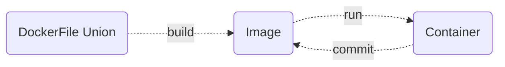

# ***Docker技术***

[toc]


## **Docker**

**Docker 包括三个基本概念**

- **镜像（Image）相当于一个 root 文件系统。比如官方镜像 ubuntu:16.04 就包含了完整的一套 Ubuntu16.04 最小系统的 root 文件系统**

- **容器（Container）和镜像（Image）的关系，就像是面向对象程序设计中的实例和类**

  > | **Docker** | **面向对象** |
  > | :--------: | :----------: |
  > |  **容器**  |   **实例**   |
  > |  **镜像**  |    **类**    |

  **镜像是静态的定义，容器是镜像运行时的实例。容器可以被创建、启动、停止、删除、暂停等**

- **仓库（Repository）仓库可看成一个代码控制中心，用来保存镜像**


## **前言**

​	**一款产品从开发到上线，从操作系统，到运行环境，再到应用配置。对于开发与运维之间的协作我们需要关心很多东西，这也是很多互联网公司都不得不面对的问题，特别是各种版本的迭代之后，不同版本环境的兼容，对运维人员都是考验 。Docker 之所以发展如此迅速，也是因为它对此给出了一个标准化的解决方案**

​		**环境配置如此麻烦，换一台机器，就要重来一次，费力费时。很多人想到，能不能从根本上解决问题，软件可以带环境安装？也就是说，安装的时候，把原始环境一模一样地复制过来。开发人员利用 Docker 可以消除产品协作编码时「在我的机器上可正常工作」问题**

​		**Docker 镜像的设计，使得 Docker 得以打破过去程序即应用的观念。透过镜像将作业系统核心除外，运作应用程式所需要的系统环境，由下而上打包，达到应用程式跨平台间的无缝接轨运作**


## **核心概念**

|       **名称**       |  **关键字**   |                           **描述**                           |
| :------------------: | :-----------: | :----------------------------------------------------------: |
|   **Docker 镜像**    |  **Images**   |       **用于创建 Docker 容器的模板，比如 Ubuntu 系统**       |
|   **Docker 容器**    | **Container** |     **容器是独立运行的一个或一组应用，是镜像运行的实例**     |
|  **Docker 客户端**   |  **Client**   | **通过命令行或者其他工具使用 [Docker SDK]( (https://docs.docker.com/develop/sdk/)) 与 Docker 的守护进程通信** |
|   **Docker 主机**    |   **Host**    |   **一个物理或者虚拟的机器用于执行 Docker 守护进程和容器**   |
| **Docker  仓库管理** | **Registry**  | **可以理解为代码控制中的代码仓库 [Docker Hub](https://hub.docker.com/) 提供了庞大的镜像集合供使用。一个 Docker Registry 中可以包含多个 Repository，每个仓库可以包含多个标签，每个标签对应一个镜像** |
|    **Docker 机**     |  **Machine**  | **一个简化 Docker 安装的命令行工具，通过一个简单的命令行即可在相应的平台上安装 Docker，比如 VirtualBox、 Digital Ocean、Microsoft Azure** |


### **帮助命令**

```shell
# 查看 docker 帮助与 docker 命令的帮助
docker --help
docker [command] --help

# 查看 docker 版本信息
docker version

# 查看 docker 全部信息
docker info
```


## **镜像**

**Docker 镜像基于 Union 文件系统构建**





**下四层是 Docker 用于构建 Docker 镜像的 DockerFile**

- **FROM ubuntu:14.04**

  > **设置基础镜像，此时会使用基础镜像 ubuntu:14.04 的所有镜像层**

- **ADD run.sh /**

  > **将 Dockerfile 所在目录的文件 run.sh 加至镜像的根目录，此时新一层的镜像只有一项内容，即根目录下的 run.sh**

- **VOLUME /data**

  > **设定镜像的 VOLUME，此 VOLUME 在容器内部的路径为 /data。需要注意的是，此时并未在新一层的镜像中添加任何文件，但更新了镜像的 json 文件，以便通过此镜像启动容器时获取这方面的信息**

- **CMD ["./run.sh"]**

  > **设置镜像的默认执行入口，此命令同样不会在新建镜像中添加任何文件，仅仅在上一层镜像 json 文件的基础上更新新建镜像的 json 文件**


**上两层是 Docker 为 Docker 容器新建的内容**

- **初始层**

  > **大多是初始化容器环境时，与容器相关的环境信息，如容器主机名，主机host信息以及域名服务文件等**

- **读写层**

  > **Docker 容器内的进程只对可读写层拥有写权限，其他层对进程而言都是只读的。 另外，关于 VOLUME 以及容器的 hosts、hostname、resolv.conf 文件等都会挂载到这里**


### **镜像命令**

```shell
# 列出本地镜像
docker images [option]

# 常用 option
-a 列出所有镜像
-q 只列出镜像id
--digests 显示摘要信息
--no-trunc 显示详细信息

# 搜索镜像名字会在 docker 社区搜索相关的镜像，可以配置的阿里源等高速通道
docker search [option]

# 常用 option
-s 显示收藏数不小于指定值的镜像
--no-trunc 显示详细信息
-automated 只列出 automated 类型的镜像

# 下载镜像
docker pull 镜像的名字:TAG(不写默认为 lasted)

# 删除镜像
docker rmi -f 镜像名/镜像id
```


## **容器**

​		**虚拟机是带环境安装的一种解决方案。它可以在一种操作系统里面运行另一种操作系统，比如在 Windows 系统里面运行 Linux 系统。应用程序对此毫无感知，因为虚拟机看上去跟真实系统一模一样，但是也有不少缺点比如资源占用多、冗余步骤多 、启动慢等**

​		**容器同样的是带环境安装的一种解决方案，但不是模拟一个完整的操作系统，而是对进程进行隔离。有了容器，就可以将软件运行所需的所有资源打包到一个隔离的容器中。容器与虚拟机不同，不需要捆绑一整套操作系统，只需要软件工作所需的库资源和配置。系统因此而变得高效轻量并保证部署在任何环境中的软件都能始终如一地运行。**

> **虚拟机是虚拟出一套硬件后，在其上运行一个完整操作系统，在该系统上再运行所需应用进程**
>
> **容器内的应用进程直接运行于宿主机的内核，容器内的抽象层更少，没有自己的内核，也没有进行硬件虚拟。因此容器要比传统虚拟机更为轻便，在CPU、内存利用率上将会在效率更高。并且每个容器之间互相隔离，每个容器有自己的文件系统 ，容器之间进程不会相互影响，能区分计算资源**

​		**Docker 容器是一个客户端-服务器结构即主从式架构的系统，Docker 守护进程运行在宿主机上，通过 Socket 连接从客户端访问，守护进程从客户端接受命令并管理运行在宿主机上的容器**

​		**Docker 的与众不同就蕴含在 Logo 之中，宿主机是汪洋大海，Docker 是海里的鲸鱼，容器就是鲸鱼驮着的集装箱**


### **容器命令**

```shell
# 新建并启动容器
docker run [option] image [command] [args...]

# 常用 option
	--name="容器新名字" 为容器指定一个名称
	-d 后台运行容器，并返回容器ID，也即启动守护式容器
	-i 以交互模式运行容器
	-t 为容器重新分配一个伪输入终端
	-P 随机端口映射
	-p 指定端口映射，有以下四种格式
	      ip:hostPort:containerPort
	      ip::containerPort
	      hostPort:containerPort
	      containerPort
	-v, --volume 绑定一个挂载卷
	      
e.g. docker run -it ubuntu ping www.docker.com 

# 查询当前正在运行的容器，类比虚拟机中的查看进程
docker ps [option] 

# 常用 option
	-a 列出当前所有正在运行的容器+历史上运行过的
	-l 显示最近创建的容器
	-n 显示最近n个创建的容器
	-q 静默模式，只显示容器编号
	--no-trunc 不截断输出信息

# 启动容器
docker start 容器ID/容器名

# 查看容器内运行的进程
docker top 容器ID

# 查看容器内部细节
docker inspect 容器ID

# 查看数据卷
docker volume ls

# 重启容器 
docker restart

# 停止容器
docker stop 容器ID/容器名

# 强制停止容器
docker kill 容器ID/容器名

# 退出容器
exit 容器停止后退出
ctrl+p+q 容器不停止退出

# 删除已经停止的容器，如果没有停止，删除后会停止
docker rm 容器ID

# 删除多个容器，先查询所有运行的进程，然后通过管道传到后面的删除操作中
docker rm -f $(docker ps -a -q)
```


## **应用部署**

### **MySQL**

```shell
# 以安装 mysql5.6 为例
docker pull mysql:5.6

# 运行镜像，启动容器，端口3306，root 用户密码:root，运行镜像:mysql5.6
docker run -p 3306:3306 --name mysql -v /datebase/mysql/conf:/etc/mysql/conf.d -v /datebase/mysql/logs:/logs -v /datebase/mysql/data:/var/lib/mysql -e MYSQL_ROOT_PASSWORD=root -d mysql:5.6

# 进入 mysql 内部测试登陆
docker ps
# 进入 mysql 的当前目录下
docker exec -it mysql运行成功后的容器ID/name /bin/bash
# 输入账号密码
mysql -u 账号 -p

# 连接数据库的图形化界面
# 解决 mysql 连接客户端时出现1251 client does not support ...问题
ALTER USER  'root'@'%' IDENTIFIED WITH mysql_native_password BY 'mysql密码';
ALTER USER  'root'@'localhost' IDENTIFIED WITH mysql_native_password BY 'mysql密码';

# 备份数据库数据，之后我们可以通过直接读取这个sql文件恢复数据
docker exec mysql服务容器ID sh -c ' exec mysqldump --all-databases -uroot -p"root" ' > /datebase/all-databases.sql
```


### **Redis**

```shell
# 下载最新版 redis 镜像
docker pull redis

# 运行镜像，启动容器，redis 端口2333
# 注意本地数据卷与容器内数据卷目录的对应
docker run -p 2333:6379 -v /myuse/myredis/data:/data -v /myuse/myredis/conf/redis.conf:/usr/local/etc/redis/redis.conf -d redis redis-server /usr/local/etc/redis/redis.conf --appendonly yes

# 以带密码的方式启动, 密码设置为 root
docker run -p 2333:6379 -v /myuse/myredis/data:/data -v /myuse/myredis/conf/redis.conf:/usr/local/etc/redis/redis.conf -d redis redis-server /usr/local/etc/redis/redis.conf --appendonly yes --requirepass "root"

# 不适用上面的容器卷, 使用 docker 默认配置, 并设置自动重启
docker run --name redis -p 6379:6379 -d --restart=always redis:latest redis-server --appendonly yes --requirepass "root"

# 上传 redis.conf 到本地数据卷所在目录
本地数据卷所在目录
文件地址

# 运行 redis 的 cil----shell 命令行
docker exec -it 运行redis服务的容器ID redis-cli
# 远程连接 docker redis
docker exec -it redis_s redis-cli -h 192.168.1.100 -p 6379 -a your_password
```


### **MongoDB**

```shell
# 下载最新的 MongoDB
docker pull mongo

# 将镜像运行成容器
docker run -itd --name mongo -p 27017:27017 mongo --auth
## 参数说明
-p 27017:27017 映射容器服务的 27017 端口到宿主机的 27017 端口。外部可以直接通过 宿主机 ip:27017 访问到 mongo 的服务
--auth 需要密码才能访问容器服务

# 使用以下命令添加用户和设置密码，并且尝试连接
$ docker exec -it mongo mongo admin
# 创建一个名为 admin，密码为 123456 的用户
db.createUser({ user:'admin',pwd:'123456',roles:[ { role:'userAdminAnyDatabase', db: 'admin'}]});
# 尝试使用上面创建的用户信息进行连接
db.auth('admin', '123456')
```

