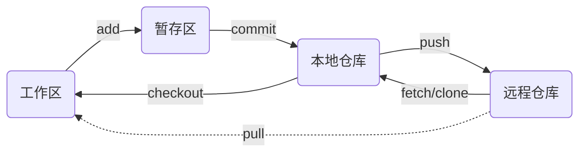

# ***Git技术***

[toc]

## **Git**

**Git 的工作就是创建和保存你项目的快照及与之后的快照进行对比，使用 bash 命令实现版本控制，常用命令是 git clone、git push、git add、git commit、git checkout、git pull 等，远端托管使用 Github 与 gitee 等，Github 远程仓库地址的默认代称是 origin，Git 初始化本地仓库的默认分支对象名字是 main 或 master**

**Git 可使用https 协议、ssh 协议 和 git 协议与远端托管建立通信**

- **https 协议的网络地址以 https:// 开头，是 http + ssl 组成的安全网络协议，http 是建立在应用层，ssl 是建立在传输层，首先需要身份授权验证（使用账号和密码）然后进行加密传输数据（账号密码以及数据传输均使用 ssl 加密）**
- **ssh 协议的网络地址以 ssh:// 开头，是建立在应用层的安全网络协议，不仅可以加密传输数据还可以进行身份授权验证，需要本地存储非对称密钥的私钥，远端托管绑定非对称密钥的公钥**

- **git 协议的网络地址以 git:// 开头，数据传输与 ssh 类似，但不需要身份验证**

  > **git@ 实际上是使用 ssh 协议。它相当于 ssh://git@**

## **工作流**

**1.  创建 Ssh Key 作为本地与 Github 通信的密钥（Gpg Key 类似）**

- **终端执行 `ssh-keygen -t rsa -f <生成路径> -C <Github 邮箱地址>` 在指定位置生成 .ssh 文件夹，其中包含 id_rsa 私钥与 id_rsa.pub 公钥，在自己 Github 账户里的设置的 Ssh Key 中输入 id_rsa.pub 公钥的内容绑定，如果本地的 id_rsa 私钥的路径不在系统环境变量中则终端执行 `git config --global core.sshCommand "ssh -i <私钥文件路径>"`（默认当前工作区有效设置`--global` 则表示全局有效）**
- **终端执行 `ssh -T git@github.com` 可以验证是否绑定成功，返回 `Hi <Github 账户名字> ! You've successfully authenticated, but GitHub does not provide shell access.` 表示成功**
- **终端执行 `git config --global user.name <你的名字>` 与 `git config --global user.email <你的邮箱地址>` 配置 Git 用户的名字与邮箱地址用于提交时的信息记录，终端执行 `git config -l` 或  `git config --list` 查看 Git 配置信息**

**2.  使用 Git 初始化本地项目文件**

- **在本地项目文件的根目录启动终端或直接启动终端执行 `cd <本地项目文件路径>`**
- **终端执行 `git init` 生成一个 .git 文件夹（实现了本地仓库与暂存区等概念以及保存各分支对象的快照），本地项目文件通过分支对象映射为工作区，初始化后本地仓库的分支对象名字是空的 '‘main’'，终端执行 `git branch -m main`（`-m` 表示将第一个参数重命名为第二个参数）将本地仓库的分支对象由空的 '‘main’' 命名为 main**
- **在 Github 新建一个空的新仓库，其默认分支对象名为 main，终端输入 `git remote add origin git@github.com:<Github 账户名字>/<仓库名字>.git` 设置远程仓库地址并代称 origin**
- **在工作区创建一个 README.md 文件，终端执行 `echo "# <本地项目文件路径>" >> README.md` 或手动在工作区创建一个 README.md 文件**
- **终端执行 `git add README.md` 或 `git add *或.`（`*或.` 表示当前工作区中的全部文件）将工作区的 README.md 文件添加到暂存区，终端执行 `git commit -m <注释信息>` （`-m` 表示提供注释信息）将暂存区新增文件提交给本地仓库并提供注释信息**

**3.  从本地仓库往远程仓库推送**

- **终端执行 `git status` 可以查看当前的状态，显示有变更的文件，终端执行 `git commit --amend -m <注释信息>` 可以修改上一次的提交且不产生新的提交**

- **终端执行 `git push -u origin main` （`-u` 表示设置 push 操作的远程仓库地址），之后直接 git push 即可 GIt 将默认使用第一次的值**

**4.  从远程仓库往工作区拉回**

- **终端执行 `git pull origin main:main` （与当前分支对象合并可以省略 `:main`）从远程仓库往工作区拉回，实际上是 `git fetch origin main` 与 `git merge FETCH_HEAD 或 origin/main` 的组合（`FETCH_HEAD` 是一个记录在本地的版本链接，指向着当前从远程仓库取下来的分支对象 `origin/main`）即获取远程仓库到本地仓库并整合分支对象，合并到本地分支对象中**

## **常用命令**

- **拷贝 Git 仓库到本地仓库**

  > ***git clone <远程仓库地址>*** 

- **删除工作区文件**

  > ***git rm <文件名字>***
  >
  > ***git rm --cached <文件名字> 仅仅删除暂存中的该文件***

- **创建分支对象** 

  > ***git branch <分支对象名字>***

- **删除的分支对象**

  > ***git branch -d <对象分支名字>***

- **检出分支对象即切换分支对象**

  > ***git checkout <分支对象名字>***

- **创建并检出分支对象**

  > ***git checkout -b <分支对象名字>***

- **查看历史提交记录**

  > ***git log*** 

- **查看指定文件的历史修改记录**

  > ***git blame <文件名字>***  

- **创建标签**

  > ***git tag <标签名字> tag 是指向本地的提交的指针，需要通过 git push origin <标签名字> 单独推送到远程仓库，本地多个标签可一次性推送 git push origin --tags***  
  >
  > ***git tag -a <标签名字> <Commit Id>  -m "release 0.1.0 version" 为特定的一次提交添加标签并添加附注标签 （-a 意为带注解的会记录标签时间等）***
  >
  > ***git tag -l 查看本地标签*** 
  >
  > ***git tag -d <标签名字> 删除本地 tag***
  >
  > ***git push origin :<标签名字> 远程 tag 的删除***
  >
  > ***git ls-remote --tags origin 查看远程的标签***
  >
  > ***git checkout -b <分支对象名字> <标签名字> 等价于  git checkout -b <分支对象名字> <Commit ID> 创建新的分支并把某一次的提交放入工作区***

- **回退版本**

  >  ***git reset <--mixed | --hard> HEAD （HEAD 是当前提交的指针）其中 --mixed 是默认参数，重置暂存区与上一次的提交保持一致，工作区保持不变***
  >
  > ***git reset --hard HEAD~3 回退上上上一个版本（HEAD~3 是当前提交的上 3 次提交）使用 --hard 参数会撤销工作区中所有未提交的修改内容，将暂存区与工作区都回到指令版本，并删除之前的所有信息提交***  
  >
  > ***git reset --hard origin/main 将本地的状态回退到和远程的一样***

- **合并分支对象**

  > ***git merge <目标分支对象名字> 直接把目标分支对象合并到当前分支对象中*** 
  
- **变基整合分支对象**

  > ***git rebase <目标基底分支对象名字>***
  >
  > ***原理是找到当前分支对象与变基操作的目标基底分支对象的最近共同祖先分支对象的快照，然后对比当前分支相对于该祖先分支对象的历次提交，提取相应的修改并存为临时文件，然后将当前分支指向目标基底分支对象, 最后对其应用之前另存为临时文件的修改，rebase 相较于 merge 会在合并分支对象的基础上优化整个分支对象的历史，使其变得像一条直线，同时也会导致快照的顺序与真实提交时间的差异***

## **解决冲突**

**把远程仓库的分支对象 master 合并到分支对象 main 上，应当在本地仓库中合并分支对象，发生冲突，方便解决**

- **把远程仓库的分支对象 main  拷贝一份到本地**

- **本地分支对象上创建一个分支对象 master，把远程仓库的分支对象 master 拷贝到本地仓库的分支对象 master，在本地将 mian 和 master 分支对象合并为 main**

- **解决冲突后推送到远程仓库的分支对象 main 再删除远程仓库的 master 分支对象，实现远程仓库的 main 与 master 分支对象的合并**

