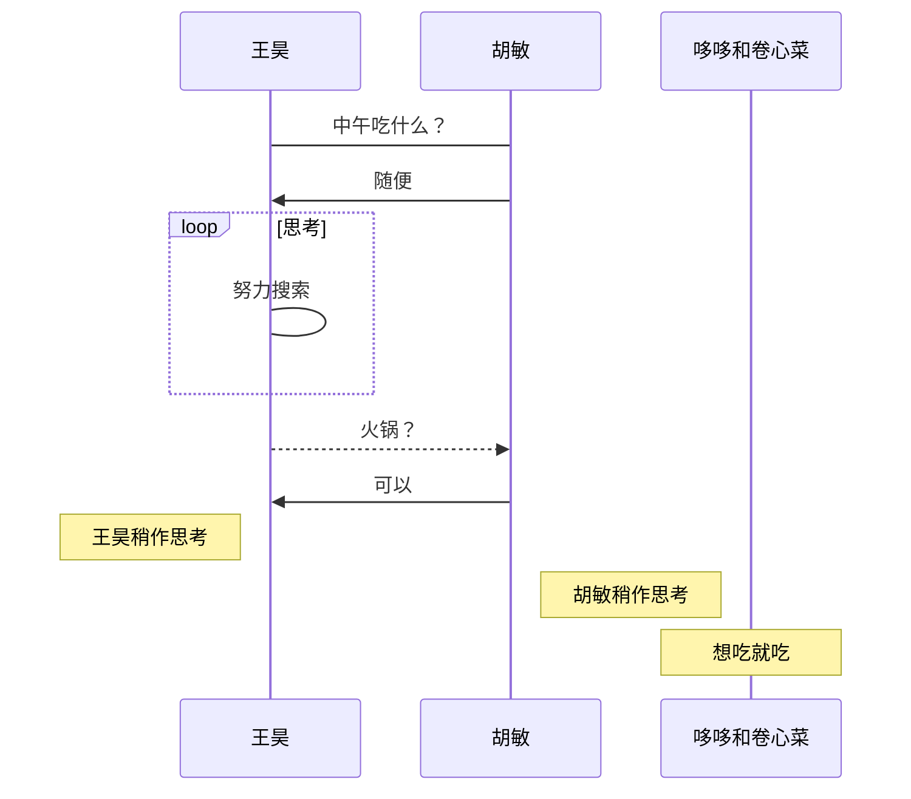
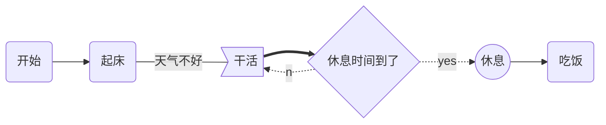
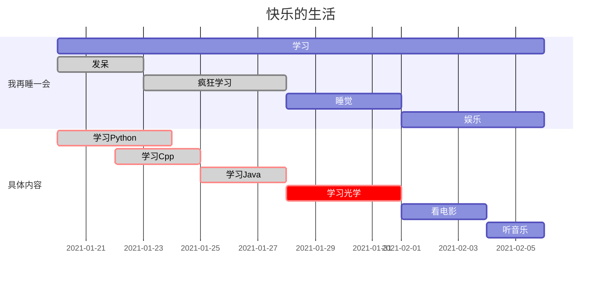

# ***Markdown*** **语法**

[toc]


## **前言**

***Markdoen* 语法有两个特点**
**1. 大多书操作符号中关键字不区分大小写且能够解析部分 *HTML* 语言**
**2. 严格条件下大多数操作符号后需要写下空格用于执行** 


## **基础语法**

|操作名称|操作符号|描述|
|:-:|:-:|:--|
|**目录**|`[TOC]`|*1.* 根据标题生成目录  *2.* 回车执行|
|**标题**|`#`|*1.* 数量表示标题级数  *2.* 最多六级标题|
|**字体**|`<font face="楷体" color=red size=5> </font>`|内容写在两对尖括号中间|
|**转义**|`\`|转换字符的意义|
|**换行**|`<br>` 和 `<br/>`|*1.* 同时按住回车加转换键换行  <br />*2.* 行尾写两个空格再按下 *1* 中快捷键是硬换行<br>*3.* 尖括号内任意写空格不影响|
|**换段**|`无`|*1.* 按下回车  *2.* 空白处点击光标|
|**制表符**|`Tab`|占位四个空格|
|**引用**|`>` 和 `》`|*1.* 电子邮件风格  *2.* 可以嵌套|
|**注脚**|`[^ID] `|在段落后通过 `[^ID]:URL` 记录内容|
|**段水平线**|`<hr>` 和 `<hr/>`|尖括号内任意写空格不影响|
|**行水平线**|`---` 和 `+++` 和 `***`|在三个及以上的下划线、星号和连字符后回车|
|**无序列表**|`-` 和 `+` 和 `*`|*1.* 按下回车继续生成列表<br>*2.* 若不输入内容继续按下回车则改行列表|
|**有序列表**|`1.`|同上|
|**任务列表**|`- [ ]` 和 `- [x]`|**x** 表示已经完成|
|**代码块**|````语言类型`|回车执行|
|**代码**|\` `|内容写在中间|
|**上下标**|`~ ~` 和 `^ ^`|同上|
|**高亮**|`== ==`|同上|
|**加粗**|`** **` 和 `__ __`|同上|
|**倾斜**|`* *` 和 `_ _`|同上|
|**删除线**|`~~ ~~`|同上|
|**下划线**|`<u> </u>`|同上|
|**居中**|`<center> </center>`|同上|
|***emoji 表情***|`: :`|同上|
|**链接**|`<URL>` 和 `[ID]:URL`|按住命令键再点击 *URL* 可以跳转网址|
|**超链接**|`[ALT](URL)` 和 `[ALT][ID]` <br />以及 `<a href="url" target="name">alt</a>`|按住命令键再点击 *ALT* 可以跳转到 *URL* 或 *ID* 指定的 *URL*|
|**图片**|``<br />和<br/>``<br>``<br>``<br>``|*1.* *URL* 使用相对地址具有更多灵活性<br>*2.* 关键字 *src* 需要小写<br>*3.* 调整大小可以通过关键字 *style width height*<br>*4.* *style="zoom:0.5"* 中不写单位 *%* 默认是百分比<br>*5.* *zoom* 可以使用 *width* 等价替换<br>*6.* *width="50"* 默认是 *px* 像素可写百分比 *50%*  <br>*7.* *height="50"* 只能指定像素数|
|**多图**|``<br />`<center>   </center>`|*1.* 居中并排<br />*2.* 使用 `<figure> </figure>` 包裹靠左并排<br />*3.* 其中添加 `<div> </div>` 包裹图注|


## **表格**

### **普通表格**

- ***Markdown* 语法，定义三列表格，第一行为表头，第二行为对齐方式，分别按左对齐、中对齐和右对齐**

  | key  | value | tips |
  | :--- | :---: | ---: |

- **源代码**

  ```markdown
  |key|value|tips|
  |:-|:-:|-:|
  ```


### **高级表格**

- ***Html* 语法，具有更丰富的变化**

  > **`<tr>` 即 *table row* `<tr> </tr>` 包裹一行的内容**
  >
  > **`<th>` 即 *table head* `<th> </th>` 包裹一行的内容会加粗即标题**
  >
  > **`<td>` 即 *table data* `<td> </td>` 包裹一行的每列内容**

  <table>
      <tr>
          <th >key</th>
          <th ><center>value</center></th>
        	<th style='text-align:right'>tips</th>
      </tr>
  </table>

  <table>
      <tr>
          <td width="80%">
              <table>
                  <tr>
                      <th align="right">name</th>
                      <td align="left">王某某</td>
                  </tr>
                  <tr>
                      <th align="right">gender</th>
                      <td align="left">男</td>
                  </tr>
                  <tr>
                      <th align="right">telephone</th>
                      <td align="left">183xxxxxxxx</td>
                  </tr>
                  <tr>
                      <th align="right">email</th>
                      <td align="left">whxxxxxxxxx@gmail.com</td>
                  </tr>
              </table>
          </td>
          <td width="20%" height="100%">  </td>
      </tr>
  </table>

- **源代码**

  ```markdown
  <table>
      <tr>
          <th >key</th>
          <th ><center>value</center></th>
        	<th style='text-align:right'>tips</th>
      </tr>
  </table>
  ```

  ```markdown
  <table>
      <tr>
          <td width="80%">
              <table>
                  <tr>
                      <th align="right">name</td>
                      <td align="left">王某某</td>
                  </tr>
                  <tr>
                      <th align="right">gender</td>
                      <td align="left">男</td>
                  </tr>
                  <tr>
                      <th align="right">telephone</td>
                      <td align="left">183xxxxxxxx</td>
                  </tr>
                  <tr>
                      <th align="right">email</td>
                      <td align="left">whxxxxxxxxx@gmail.com</td>
                  </tr>
              </table>
          </td>
          <td width="20%" height="100%">  </td>
      </tr>
  </table>
  ```


## **绘图**

**调用 *js-sequence-diagram*、*flowchart.js* 和 *mermaid engine* 绘制 *SVG* 顺序图、流程图和甘特图** 


### **顺序图**

#### **标准顺序图 *sequence***

- **基本语法**

  > **`title: 标题` 指定时序图的标题**
  >
  > **`Note direction of 对象:描述`  在对象的某一侧添加描述 `direction` 可以为 `right/left/over` ，`对象` 可是多个，以 `,` 分隔**
  >
  > **`participant 对象` 创建一个对象，也可不使用关键词直接创建对象**
  >
  > **`对象A->对象B:描述` 绘制A与B之间的对话实线连接，`->` 实线实心箭头指向，`-->` 虚线实心箭头指向，`->>` 实线小箭头指向，`-->>` 虚线小箭头指向**

```sequence
title: 打招呼
participant 王昊
王昊 -> 胡敏: 小敏，吃了么您内?
Note right of 胡敏: 胡敏稍作思考
胡敏 --> 王昊: 早呀，吃了呀，您内?
```

- **源代码**

  ```markdown
  title: 打招呼
  participant 王昊
  王昊 -> 胡敏: 小敏，吃了么您内?
  Note right of 胡敏: 胡敏稍作思考
  胡敏 --> 王昊: 早呀，吃了呀，您内?
  ```


#### **样式顺序图 *mermaid* 的 *sequenceDiagram***

- **基本语法同标准时序图，线条样式不同**

  > **`->` 实线连接，`-->` 虚线连接，`->>` 实线箭头指向，`-->>` 虚线箭头指向**



- **源代码**

  ```markdown
  sequenceDiagram
  王昊->胡敏:中午吃什么？
  胡敏->>王昊: 随便
  loop 思考
      王昊->王昊: 努力搜索
  end
  王昊-->>胡敏: 火锅？
  胡敏->>王昊: 可以
  Note left of 王昊: 王昊稍作思考
  Note right of 胡敏: 胡敏稍作思考
  participant 哆哆和卷心菜
  Note over 哆哆和卷心菜: 想吃就吃
  ```


### **流程图**

#### **标准流程图 *flowchart***

- **定义模块**

  > **`id=>关键字: 描述`  “描述”的前面必须有空格，“=>” 两端不能有空格**

- **关键字**

  > **`start` 流程开始，以圆角矩形绘制**
  >
  > **`opearation` 操作，以直角矩形绘制**
  >
  > **`condition` 判断，以菱形绘制**
  >
  > **`subroutine` 子流程，以左右带空白框的矩形绘制**
  >
  > **`inputoutput` 输入输出，以平行四边形绘制**
  >
  > **`end` 流程结束，以圆角矩形绘制**

- **定义模块的方向**

  > **`模块1 id->模块2 id` ，一般的箭头指向；`条件模块id (描述)->模块id(direction)` ，条件模块跳转到对应的执行模块，并指定对应分支的布局方向**

```flow
st=>start: 放假
op=>operation: 回家
cond=>condition: 吃饭
e=>end: 躺倒
st->op->cond
cond(yes)->e
```

- **源代码**

  ```markdown
  st=>start: 放假
  op=>operation: 回家
  cond=>condition: 吃饭
  e=>end: 躺倒
  st->op->cond
  cond(yes)->e
  ```


#### **样式流程图 *mermaid* 的 *gragh***

- **图的方向定义**

  > **`graph LR` 横向，`graph TD` 纵向** 

- **元素的形状定义**

  > **`id[描述]` 以直角矩形绘制，`id(描述)` 以圆角矩形绘制，`id{描述}` 以菱形绘制，`id>描述]` 以不对称矩形绘制，`id((描述))` 以圆形绘制**

- **线条的样式定义**

  > **`A-->B` 带箭头指向，`A---B` 不带箭头连接，`A-.-B` 虚线连接，`A-.->B` 虚线指向，`A==>B` 加粗箭头指向，`A--描述---B` 不带箭头指向并在线段中间添加描述，`A--描述-->B` 带描述的箭头指向，`A-.描述.->B` 带描述的虚线连指向，`A==描述==>B` 带描述的加粗箭头指向**



- **源代码**

  ```markdown
  graph LR
      A(开始) -->B(起床)
      B --天气不好--- C>干活]
      C ==> D{休息时间到了}
      D -.yes.-> E((休息))
      D -.no.-> C
      E --> F(吃饭)
  ```


### **甘特图 *gantt***

**使用 *mermaid* 的 *gantt* 关键字**

- **基本语法**

  > `deteFormat 格式` 指明日期的显示格式，`title 标题` 设置图标的标题，`section 描述` 定义纵向上的一个环节

- **定义步骤**

  > 每个步骤有两种状态 *done*（已完成）和 *active*（执行中）
  >
  > `描述: 状态id1, 开始日期, 结束日期/持续时间`
  >
  > `描述: 状态id1, after id2, 持续时间`
  >
  > `crit` 可用于标记该步骤需要被修正，将高亮显示
  >
  > 如果不指定具体的开始时间或在某个步骤之后，将默认依次顺序排列



- **源代码**

  ```markdown
  gantt
  dateFormat  YYYY-MM-DD
  title 快乐的生活
  section 我再睡一会
  学习: des1, 2021-01-20,2021-02-06
  发呆: done, des2, 2021-01-20, 3d
  疯狂学习: done, des3, after des2, 5d
  睡觉: des4, after des3, 4d
  娱乐: des5, 2021-02-01,2021-02-06
  section 具体内容
  学习Python: crit, done, 2021-01-20,96h
  学习Cpp: crit, done, 2021-01-22, 3d
  学习Java: crit, done, 3d
  学习光学: crit, 4d
  看电影: 3d
  听音乐: 2d
  ```


## ***YAML Front Matter***

**在文档顶端输入 `---` 回车将会插入一个元数据块用于定义文档的全局变量例如图床地址等** 


## ***LaTex***

**使用 `$ $ ` 或 `$$ $$` 包裹七类符号，分别是「Ord」普通符号，拉丁字母等；「Op」计算符号，求和积分等；「Bin」二元运算符号，加减乘除、交集和并集等；「Rel」二元关系符号，等于、约等于和大于小于等；「Open」左括号与「Close」右括号以及「Punct」标点符号，不同类别符号组合会呈现不同疏密程度的间距并且随着场景不同而相应变化，默认字体 Cambria Math，默认字号正文 10 磅、一级上下标 7 磅和二级及以上上下标 5 磅**


### **行内公式**

- **符号** 

  > $\pi$	

- **源代码** 

  > ```markdown
  > $\pi$ 
  > ```


### **行间公式**

- **符号**

  > $$
  > \pi
  > $$

- **源代码** 

  > ```markdown
  > $$
  > \pi
  > $$
  > ```


### **字体**

|                             符号                             |                            源代码                            |    描述    |
| :----------------------------------------------------------: | :----------------------------------------------------------: | :--------: |
|                         $\mathrm{X}$                         |                        `$\mathrm{X}$`                        | 数学罗马体 |
|                          $\Bbb{R}$                           |                  `$\Bbb{R}$` 和 `$\mathbb$`                  | 数学黑板体 |
|                        $\mathcal{N}$                         |                       `$\mathcal{N}$`                        |  数学花体  |
|                     $\text{e.g.  text}$                      |                    `$\text{e.g.  text}$`                     | 纯文本注释 |
| $\tiny text$<br/>$\scriptsize text$<br/>$\small text$<br/>$\normalsize text$<br/>$\large text$<br/>$\Large text$<br/>$\LARGE text$<br/>$\huge text$<br/>$\Huge text$ | `$\tiny text$`<br/>`$\scriptsize text$`<br/>`$\small text$`<br/>`$\normalsize text$`<br/>`$\large text$`<br/>`$\Large text$`<br/>`$\LARGE text$`<br/>`$\huge text$`<br/>`$\Huge text$` |  字体大小  |
|         $\color{red}{text}$ 和 $\color{#f00}{text}$          |       `$\color{red}{text}$` 和 `$\color{#f00}{text}$`        |  字体颜色  |


### **字符**

|    符号     |    源代码     |   符号    |   源代码    |    符号     |    源代码     |     符号     |     源代码     |
| :---------: | :-----------: | :-------: | :---------: | :---------: | :-----------: | :----------: | :------------: |
|  $\alpha$   |  `$\alphaα$`  |    $A$    |    `$A$`    |   $\beta$   |   `$\beta$`   |     $B$      |     `$B$`      |
|  $\gamma$   |  `$\gamma$`   | $\Gamma$  | `$\Gamma$`  |  $\delta$   |  `$\delta$`   |   $\Delta$   |   `$\Delta$`   |
| $\epsilon$  | `$\epsilon$`  |    $E$    |    `$E$`    |   $\zeta$   |     `$Z$`     |     $Z$      |     `$Z$`      |
|   $\eta$    |   `$\eta$`    |    $H$    |    `$H$`    |  $\theta$   |  `$\theta$`   |   $\Theta$   |   `$\Theta$`   |
|   $\iota$   |   `$\iota$`   |    $I$    |    `$I$`    |  $\kappa$   |  `$\kappa$`   |     $K$      |     `$K$`      |
|  $\lambda$  |  `$\lambda$`  | $\Lambda$ | `$\Lambda$` |    $\nu$    |    `$\nu$`    |     $N$      |     `$N$`      |
|    $\mu$    |    `$\mu$`    |    $M$    |    `$M$`    |    $\xi$    |    `$\xi$`    |    $\Xi$     |    `$\Xi$`     |
|     $o$     |     `$o$`     |    $O$    |    `$O$`    |    $\pi$    |    `$\pi$`    |    $\Pi$     |    `$\Pi$`     |
|   $\rho$    |   `$\rho$`    |    $P$    |    `$P$`    |  $\sigma$   |  `$\sigma$`   |   $\Sigma$   |   `$\Sigma$`   |
|   $\tau$    |   `$\tau$`    |    $T$    |    `$T$`    | $\upsilon$  | `$\upsilon$`  |  $\Upsilon$  |  `$\Upsilon$`  |
|   $\phi$    |   `$\phi$`    |  $\phi$   |  `$\phi$`   |   $\chi$    |   `$\chi$`    |    $\chi$    |    `$\chi$`    |
|   $\psi$    |   `$\psi$`    |  $\Psi$   |  `$\Psi$`   |  $\omega$   |  `$\omega$`   |   $\Omega$   |   `$\Omega$`   |
| $\varsigma$ | `$\varsigma$` | $\varphi$ | `$\varphi$` |   $\beth$   |   `$\beth$`   |  $\daleth$   |  `$\daleth$`   |
|  $\gimel$   |  `$\gimel$`   | $\aleph$  | `$\aleph$`  |  $\nabla$   |  `$\nabla$`   | $\bigoplus$  | `$\bigoplus$`  |
|   $\sum$    |   `$\sum$`    |  $\prod$  |  `$\prod$`  |  $\times$   |  `$\times$`   |    $\div$    |    `$\div$`    |
|   $\cdot$   |   `$\cdot$`   |  $\ast$   |  `$\ast$`   | $\bigodot$  | `$\bigodot$`  | $\bigotimes$ | `$\bigotimes$` |
|   $\mid$    |   `$\mid$`    |  $\nmid$  |  `$\nmid$`  | $\parallel$ | `$\parallel$` | $\nparallel$ | `$\nparallel$` |


### **空白**

|       符号       |      源代码      |   描述   |
| :--------------: | :--------------: | :------: |
|      $a\!b$      |      `$\!$`      |   紧贴   |
|      $a\,b$      |      `$\,$`      |  小空格  |
| $a\:b$ 或 $a\;b$ | `$\:$` 或 `$\;$` |  中空格  |
|    $a\quad b$    |    `$\quad$`     |   空格   |
|   $a\qquad b$    |    `$\qquad$`    | 两个空格 |


### **上下标和括号**

|                          符号                          |                            源代码                            |
| :----------------------------------------------------: | :----------------------------------------------------------: |
|           $a^{i}$ 和 $a_{j}$ 和 $a^{i}_{j}$            |           `$a^{i}$` 和 `$a_{j}$` 和 `$a^{i}_{j}$`            |
| $\bar{a}$ 和 $\acute{a}$ 和 $\breve{a}$ 和 $\grave{a}$ | `$\bar{a}$` 和 `$\acute{a}$`和 `$\breve{a}$` 和 `$\grave{a}$` |
|       $\dot{a}$ 和 $\ddot{a}$ 和 $\dot{\dot{a}}$       |       `$\dot{a}$` 和 `$\ddot{a}$` 和 `$\dot{\dot{a}}$`       |
|              $\hat{a}$ 和 $\widehat{ab}$               |               `$\hat{a}$ `和 `$\widehat{ab}$`                |
|       $\check{a}$ 和 $\breve{a}$ 和 $\tilde{a}$        |       `$\check{a}$` 和 `$\breve{a}$` 和 `$\tilde{a}$`        |
|                  $\overline{a+b+c+d}$                  |                    `$\overline{a+b+c+d}$`                    |
|                 $\underline{a+b+c+d}$                  |                   `$\underline{a+b+c+d}$`                    |
|                 $\overbrace{a+b+c+d}$                  |                   `$\overbrace{a+b+c+d}$`                    |
|                 $\underbrace{a+b+c+d}$                 |                   `$\underbrace{a+b+c+d}$`                   |
|     $\overbrace{a+\underbrace{b+c}_{1.0}+d}^{2.0}$     |       `$\overbrace{a+\underbrace{b+c}_{1.0}+d}^{2.0}$`       |
|                 $\langle$ 和 $\rangle$                 |                  `$\langle$` 和 `$\rangle$`                  |
|         $\{$ 和 $\}$ 或 $\lbrace$ 和 $\rbrace$         |        `$\{$` 和 `$\}$` 或 `$\lbrace$` 和 `$\rbrace$`        |
|                         ( 和 )                         |                          `(` 和 `)`                          |
|                  $\bigg($ 和 $\bigg)$                  |                   `$\bigg($` 和 `$\bigg)$`                   |
|                  $\Bigg($ 和 $\Bigg)$                  |                   `$\Bigg($` 和 `$\Bigg)$`                   |
|                         [ 和 ]                         |                          `[ `和 `]`                          |
|                        \| 或 ｜                        |                         `|` 或 `｜`                          |
|                 $\lfloor$ 和 $\rfloor$                 |                 `$\lfloor$` 和 `$\rfloor$ `                  |


### **矢量和方向**

|                符号                |                 源代码                 | 描述 |
| :--------------------------------: | :------------------------------------: | :--: |
|            $\mathbf{x}$            |             `$\mathbf{x}$`             | 矢量 |
|             $\vec{x}$              |              `$\vec{x}$`               | 矢量 |
|        $\overleftarrow{x}$         |         `$\overleftarrow{x}$`          |      |
|        $\overrightarrow{x}$        |         `$\overrightarrow{x}$`         | 向量 |
|  $\leftarrow$ 和 $\longleftarrow$  |  `$\leftarrow$` 和 `$\longleftarrow$`  |      |
| $\rightarrow$ 和 $\longrightarrow$ | `$\rightarrow$` 和 `$\longrightarrow$` |      |
|             $\uparrow$             |              `$\uparrow$`              |      |
|            $\downarrow$            |             `$\downarrow$`             |      |
|  $\Leftarrow$ 和 $\Longleftarrow$  |  `$\Leftarrow$` 和 `$\Longleftarrow$`  |      |
| $\Rightarrow$ 和 $\Longrightarrow$ | `$\Rightarrow$ `和 `$\Longrightarrow$` |      |
|             $\Uparrow$             |              `$\Uparrow$`              |      |
|            $\Downarrow$            |             `$\Downarrow$`             |      |
|               $\bot$               |                `$\bot$`                | 垂直 |
|         $\angle\,45^\circ$         |          `$\angle\,45^\circ$`          |      |


### **分式和根式**

|                             符号                             |                            源代码                            |    描述    |
| :----------------------------------------------------------: | :----------------------------------------------------------: | :--------: |
|                        $\frac{x}{y}$                         |                       `$\frac{x}{y}$`                        |   自匹配   |
|                        $\dfrac{x}{y}$                        |                       `$\dfrac{x}{y}$`                       |  大号分式  |
|                        $\tfrac{x}{y}$                        |                       `$\tfrac{x}{y}$`                       |  小号分式  |
|                      $\tiny\frac{x}{y}$                      |                     `$\tiny\frac{x}{y}$`                     | 超小号分式 |
| $y=x_0+\cfrac{1^2}{x_1+\cfrac{2^2}{x_2+\cfrac{3^2}{x_3+\cfrac{4^2}{x_4+...}}}}$ | `$y=x_0+\cfrac{1^2}{x_1+\cfrac{2^2}{x_2+\cfrac{3^2}{x_3+\cfrac{4^2}{x_4+...}}}}$` |   连分式   |
|               $a+b+c+d+e+f \over g+h+i+j+k+l$                |              `$a+b+c+d+e+f \over g+h+i+j+k+l$`               |            |
|                          $\sqrt{m}$                          |                         `$\sqrt{m}$`                         |            |
|                        $\sqrt[o]{n}$                         |                        `$\sqrt[o]{n$`                        |            |
|             $\sqrt{1+\sqrt[r]{1+\sqrt[q]{1+p}}}$             |            `$\sqrt{1+\sqrt[r]{1+\sqrt[q]{1+p}}}$`            |            |
|          $\sqrt{1+\sqrt[^u\!]{1+\sqrt[^t\!]{1+s}}}$          |        `$\sqrt{1+\sqrt[\^u\!]{1+\sqrt[\^t\!]{1+s}}}$`        |            |


### **操作符**

|                          符号                          |                            源代码                            |    描述    |
| :----------------------------------------------------: | :----------------------------------------------------------: | :--------: |
|      $\ln{a+b}$  和 $\lg{a+b}$ 和 $\log_{a}^{b}$       |        `$\ln{a+b}$ 和 `$\lg{a+b}$ 和 `$\log_{a}^{b}$`        |            |
|           $\leq$ 和 $\geq$ 和 $\ll$ 和 $\gg$           |          `$\leq$` 和 `$\geq$` 和 `$\ll$` 和 `$\gg$`          |            |
|   $=$ 和 $\approx$ 和 $\cong$ 和 $\equiv$ 和 $\neq$    |  `$=$` 和 `$\approx$` 和 `$\cong$` 和 `$\equiv$`和 `$\neq$`  |            |
|                 $\propto$ 和 $\infty$                  |                  `$\propto$` 和 `$\infty$`                   | 正比和无穷 |
| $\emptyset$ 和 $\varnothing$ 和 $\subset$ 和 $\supset$ | `$\emptyset$` 和 `$\varnothing$`和 `$\subset$` 和 `$\supset$` |            |
|               $\in$ 和 $\ni$ 和 $\notin$               |               `$\in$` 和 `$\ni$`和 `$\notin$`                |            |
|       $\cup$ 和 $\bigcup$ 和 $\cap$ 和 $\bigcap$       |      `$\cup$` 和 `$\bigcup$` 和 `$\cap$` 和 `$\bigcap$`      |            |
|               $\because$ 和 $\therefore$               |                `$\because$` 和 `$\therefore$`                |            |
|                 $\forall$ 和 $\exists$                 |                  `$\forall$` 和 `$\exists$`                  |            |
|                         $\pm$                          |                           `$\pm$`                            |            |
|                         $\not$                         |                           `$\not$`                           |     非     |
|                 $\imath$  和 $\jmath$                  |                  `$\imath$`  和 `$\jmath$`                   |    虚数    |
|                         $\exp$                         |                           `$\exp$`                           |  自然指数  |
|                         $\lim$                         |                           `$\lim$`                           |    极限    |
|                        $\star$                         |                          `$\star$`                           |   互相关   |
|                        $\prime$                        |                          `$\prime$`                          |    导数    |
|                       $\partial$                       |                         `$\partial$`                         |    偏导    |
|             $\int$ 和 $\iint$ 和 $\iiint$              |             `$\int$` 和 `$\iint$` 和 `$\iiint$`              |    积分    |
|                        $\oint$                         |                          `$\oint$`                           |  曲线积分  |


### **公式**

- **符号**

  > $$
  > \tag{1}
  > f_1(x)
  > $$
  >
  > $$
  > f_2(x)\\
  > f_3(x)
  > $$
  >
  > $$
  > \vec{x}\stackrel{\mathrm{def}}{=}{x_1,\dots,x_n}\\ 
  > {n+1 \choose k}={n \choose k}+{n \choose k-1}\\ 
  > \sum_{k_0,k_1,\ldots>0 \atop k_0+k_1+\cdots=n}A_{k_0}A_{k_1}\cdots
  > $$
  >
  > $$
  > \begin{equation} 
  > f_4(x)=x^2
  > \end{equation}
  > $$
  >
  > $$
  > \begin{equation}
  > \begin{aligned}
  > a &=b+c+d \\
  > x &=y+z
  > \end{aligned}
  > \end{equation}
  > $$
  >
  > $$
  > y=\begin{cases}
  > 1,\quad x\leq S_1\\
  > 0, \quad x>S_2
  > \end{cases}
  > $$
  >
  > $$
  > \begin{array}&
  > 1 & 2 & 3 \\  
  > 4 & 5 & 6 \\  
  > 7 & 8 & 9
  > \end{array}
  > $$
  >
  > $$
  > \left[
  > \begin{array}{l|cr}
  > 10&11&12\\
  > 13&14&15\\
  > 15&17&18
  > \end{array}
  > \right]
  > $$
  >
  > $$
  > \left\{
  > \begin{array}{cc|c}
  > 10&11&12\\
  > 13&14&15\\
  > 15&17&18
  > \end{array}
  > \right\}
  > $$
  >
  > $$
  > \begin{equation}
  > \dot{\boldsymbol{x}}=f(\pmb{x})=
  > \left\{
  > \begin{array}{ll}   
  > f_{5}(\boldsymbol{x}) & \pmb{x} \in S_{1}\\
  > f_{6}(\pmb{x}) & \boldsymbol{x} \in S_{2}  
  > \end{array}
  > \right.
  > \end{equation}
  > $$
  >
  > $$
  > \begin{matrix}
  > 1 & 2 & 3 \\
  > 4 & 5 & 6 \\
  > 7 & 8 & 9
  > \end{matrix}
  > $$
  >
  > $$
  > \begin{bmatrix}
  > 10 & 11 & 12 \\\hline
  > 13 & 14 & 15 \\
  > 16 & 17 & 18
  > \end{bmatrix}
  > $$
  >
  > $$
  > \begin{Bmatrix}   
  > 19 & 20 & 21 \\   
  > 22 & 23 & 24 \\\hline   
  > 25 & 25 & 27
  > \end{Bmatrix}
  > $$

- **源代码**

  > ```markdown
  > $$
  > \tag{1}
  > f_1(x)
  > $$
  > 
  > $$
  > f_2(x)\\
  > f_3(x)
  > $$
  > 
  > $$
  > \vec{x}\stackrel{\mathrm{def}}{=}{x_1,\dots,x_n}\\ 
  > {n+1 \choose k}={n \choose k}+{n \choose k-1}\\ 
  > \sum_{k_0,k_1,\ldots>0 \atop k_0+k_1+\cdots=n}A_{k_0}A_{k_1}\cdots
  > $$
  > 
  > $$
  > \begin{equation} 
  > f_4(x)=x^2
  > \end{equation}
  > $$
  > 
  > $$
  > \begin{equation}
  > \begin{aligned}
  > a &=b+c+d \\
  > x &=y+z
  > \end{aligned}
  > \end{equation}
  > $$
  > 
  > $$
  > y=\begin{cases}
  > 1,\quad x\leq S_1\\
  > 0, \quad x>S_2
  > \end{cases}
  > $$
  > 
  > $$
  > \begin{array}&
  > 1 & 2 & 3 \\  
  > 4 & 5 & 6 \\  
  > 7 & 8 & 9
  > \end{array}
  > $$
  > 
  > $$
  > \left[
  > \begin{array}{l|cr}
  > 10&11&12\\
  > 13&14&15\\
  > 15&17&18
  > \end{array}
  > \right]
  > $$
  > 
  > $$
  > \left\{
  > \begin{array}{cc|c}
  > 10&11&12\\
  > 13&14&15\\
  > 15&17&18
  > \end{array}
  > \right\}
  > $$
  > 
  > $$
  > \begin{equation}
  > \dot{\boldsymbol{x}}=f(\pmb{x})=
  > \left\{
  > \begin{array}{ll}   
  > f_{5}(\boldsymbol{x}) & \pmb{x} \in S_{1}\\
  > f_{6}(\pmb{x}) & \boldsymbol{x} \in S_{2}  
  > \end{array}
  > \right.
  > \end{equation}
  > $$
  > 
  > $$
  > \begin{matrix}
  > 1 & 2 & 3 \\
  > 4 & 5 & 6 \\
  > 7 & 8 & 9
  > \end{matrix}
  > $$
  > 
  > $$
  > \begin{bmatrix}
  > 10 & 11 & 12 \\
  > 13 & 14 & 15 \\
  > 16 & 17 & 18
  > \end{bmatrix}
  > $$
  > 
  > $$
  > \begin{Bmatrix}   
  > 19 & 20 & 21 \\   
  > 22 & 23 & 24 \\   
  > 25 & 25 & 27\
  > \end{Bmatrix}
  > $$
  > ```

- **描述**

  > *\tag{标号}*	公式标号有括号 优先级高于自动编号
  > *\tag***{标号}*	公式标号无括号 优先级高于自动编号
  > *\left\\{* 和 *\right\\}*	自适应括号大小，单边括号时另一侧括号用 *.* 代替
  > &	分列
  > *\\\\*	分行
  > *\hline*	行线
  > *\stackrel{上位符号}{基位符号}*	基位符号大 上位符号小	
  > *{上位公式\choose 下位公式}*	上下符号一样大 上下符号被包括在圆弧内
  > *{上位公式\atop 下位公式}*	上下符号一样大
  > *\cdots*  $\cdots$	*\dots* $\dots$	*\ldots* $\ldots$	*\ddots* $\ddots$  *\vdots* $\vdots$	省略号
  >
  > *equation* 环境	构造有序编号公式 每行居中对齐
  > *align*ed 环境	构造有序编号公式 每行右对齐 可嵌入其他环境 同类对齐环境 *align* 不可嵌入其他环境
  > *cases* 环境	构造多分支公式
  > *array* 环境	构造数组其中 *{lcr}* 描述列对齐方式 *l* 左对齐 *c* 中对齐 *r* 右对齐 可嵌入其他环境 可构造方程
  > *matrix* 环境	构造矩阵其中不同括号 *pmatrix bmatrix Bmatrix vmatrix Vmatrix* 
