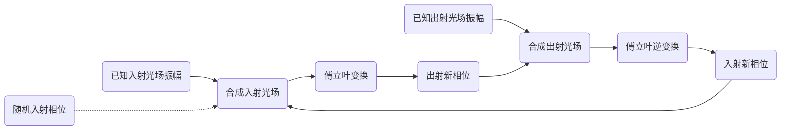

# ***光学相位恢复算法***

[toc]

## **前言**

**经典的相位恢复算法有 *1971* 年提出的 *GS* 算法和 *1980* 年提出的 *YG* 算法，分别适用于特定光学衍射过程和一般光学衍射过程**

## **Gerchberg-Saxton Algorithm**

### **基本定义**

**二维光场在物平面的入射光场可表示为**
$$
E_1(x_1,y_1)=\rho_1(x_1,y_1)\cdot e^{\imath\phi_1(x_1,y_1)}
$$
**同理，像平面的出射光场可表示为**
$$
E_2(x_2,y_2)=\rho_2(x_2,y_2)\cdot e^{\imath\phi_2(x_2,y_2)}
$$
**其中 $\rho_1(x_{1},y_{1}),\;\rho_2(x_{2},y_{2})$ 为物平面和像平面光场的振幅分布，$\phi_1(x_1,y_1),\;\phi_2(x_2,y_2)$ 为物平面和像平面光场的相位分布**

**在夫琅和费衍射或透镜衍射中，入射光场与出射光场之间存在傅立叶变换关系**

**正过程可以近似表示为**
$$
E_2(x_2,y_2)=\mathcal{F}[E_1(x_1,y_1)]
$$
**其逆过程为**
$$
E_1(x_1,y_1)=\mathcal{F}^{-1}[E_2(x_2,y_2)]
$$
**在 *GS* 算法中振幅分布 $\rho_1(x_{1},y_{1}),\;\rho_2(x_{2},y_{2})$ 已知，通过多次迭代的方法求解未知相位分布 $\phi_1(x_1,y_1),\;\phi_2(x_2,y_2)$，即通过两光场的幅度来与两光场的联系寻找两光场的相位，*GS* 算法初值敏感、易陷入局部最优，后续有诸多改进方法如加权 *GS* 算法等** 

### **算法逻辑**

**1.  随机初始化入射光场的相位 $\phi_1^{\prime}(x_1,y_1)$ ，与已知的入射光场振幅分布 $\rho_1(x_{1},y_{1})$ 合成入射光场 $E_1^{\prime}(x_1,y_1)$**

**2.  入射光场经过夫琅和费衍射或透镜汇聚过程等价通过傅立叶变换得射光场 $E_2(x_2,y_2)$ 的相位 $\phi_2(x_2,y_2)$**

**3.  由上步的新相位和已知出射光场振幅分布 $\rho_2(x_{2},y_{2})$ 合成出射光场 $E_2^{\prime}(x_2,y_2)$**

**4.  出射光经过夫琅和费衍射或透镜汇聚的逆过程等价通过傅立叶反变换得入射光场 $E_1(x_1,y_1)$ 的相位 $\phi_1(x_1,y_1)$**

**5.  由上步的新相位和已知入射光场振幅分布 $\rho_1(x_{1},y_{1})$ 合成入射光场 $E_1^{\prime}(x_1,y_1)$**

**6.  回到步骤 2 进行下一次循环，不断迭代直至光场趋于稳定 $min \frac{1}{k}\sum_{x_1,x_2,y_1,y_2=1}^{x_1,x_2,y_1,y_2=k}[\mid E_1(x_1,y_1)\mid^2-\mid E_1^{\prime}(x_1,y_1)\mid^2]^2$，$k$ 为变量的上限值**

## **杨顾算法**

### **基本定义**

***YG* 算法扩展了 *GS* 算法，解决入射光场与出射光场之间非幺正变换的情况，可普遍应用于一般衍射器件，后续有诸多改进方法如加权 *YG* 算法等**

**高维光场进行 $m$ 次均匀采样，因此物平面的入射光场可表示为**
$$
E_{1i}=\rho_{1i}\cdot e^{\imath\phi_{1i}},\;i=1,2,\cdots,m
$$
**在传播轴上进行 $n$ 次均匀采样，因此像平面的出射光场可表示为**
$$
E_{2j}=\rho_{2j}\cdot e^{\imath\phi_{2j}},\;j=1,2,\cdots,n
$$

**其中 $\rho_{1},\;\rho_{2}$ 和 $\phi_{1},\;\phi_{2}$ 分别是物平面和像平面光场的振幅和相位** 

**物平面的入射光场和像平面的出射光场之间满足一般光学变换关系，可以是非幺正变换即变换矩阵可以是非酉矩阵**

> 酉矩阵定义，设存在一个 $n$ 阶矩复数矩阵 $U$ 满足
> $$
> U^{H}U=UU^{H}=E_n
> $$
> 则 $U$ 为酉矩阵，其中 $U^H$ 是 $U$ 的共轭转置矩阵且 $U^H=U^{-1}$，$E_n$ 是 $n$ 阶单位矩阵，酉矩阵 $U$ 行与列的二阶范数都是 $1$ 且 $\parallel Ux\parallel_2=\parallel x\parallel_2$，当元素都为实数是就是正交矩阵

**正过程为**
$$
E_{2j}=\sum_{i=1}^{m}G_{ij}\cdot E_{1i}
$$

**其中 $G$ 是核函数根据描述光场传播的衍射公式以及物平面与像平面之间相互关系决定**

**定义所得光场和所需光场之间的二阶范数来描述两者的距离**
$$
D^2=\;\parallel E_{2}-G\cdot E_{1}\parallel_2
$$

**当 $D^2$ 取极小值时，物平面的入射光场的相位 $\phi_1$ 与像平面出射光场的相位 $\phi_2$ 可表示为**
$$
\tag{1}
\begin{aligned}
\phi_{1k}
&=arg\left\lfloor{\sum_{j=1}^{n}G_{jk}^HE_{2j}-\sum_{j\not=k}A_{kj}E_{1k}}\right\rfloor\\
\end{aligned}
$$

$$
\tag{2}
\begin{aligned}
\phi_{2k}
&=arg\left\lfloor{\sum_{k=1}^{m}G_{kj}E_{1k}}\right\rfloor\\
\end{aligned}
$$

**其中 $A=G^+G,\;A^H=A$ 而 $G^+$ 是 $G$ 的广义逆矩阵 *Moore-Penrose* 伪逆，$\lfloor f(x)\rfloor$ 是对 $f(x)$ 向下取整**

> *Moore-Penrose* 伪逆定义，设存在一个矩阵 $A$ 有
> $$
> A^+=\lim_{x\rightarrow0}(A^TA+xI)^{-1}A^T
> $$
> 计算式
> $$
> A^+=V^+\Sigma U^H
> $$
> 先对 $A$ 奇异值分解
> $$
> \mathrm{SVD}(A)=U\Sigma V^H
> $$
> $U,\;V^H$ 是酉矩阵，$\Sigma$ 是一个除了主对角线上的元素以外全为 $0$ 的矩阵，主对角线上的每个元素都是奇异值$U,\;V^H$ 是酉矩阵，$\Sigma$ 是一个除了主对角线上的元素以外全为 $0$ 的矩阵，主对角线上的每个元素都是奇异值，若 $A$ 为方阵则 $\Sigma$ 即为特征值矩阵 $D$
>
> 对于 $Ax=y$ 如果无解我们使用 $\parallel yA^+ -x\parallel_2$ 最小的 *Moore-Penrose* 伪逆，如果多解我们使用 $\parallel yA^+\parallel_2$ 最小的 *Moore-Penrose* 伪逆

### **算法逻辑**

**1.  随机初始化入射光场的相位 $\phi_{1}$ ，与已知的入射光场振幅分布 $\rho_{1}$ 合成初始化的入射光场 $E_{1}$**

**2.  入射光场经过正过程通过 $(2)$ 得出射光场像平面 $E_{2}$ 的相位 $\phi_{2}$**

**3.  由上步的新相位和已知出射光场振幅分布 $\rho_{2}$ 合成出射光场 $E_{2}$**

**4.  出射光场通过 $(1)$ 得出入射光场 $E_1$ 更为准确的相位 $\phi_1$**

**5.  由上步的新相位和已知入射光场振幅分布 $\rho_{1}$ 合成入射光场 $E_{1}$**

**6.  回到步骤 2 进行下一次循环，不断迭代直至光场趋于稳定是时终止**

