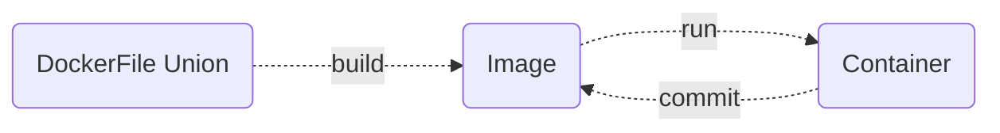
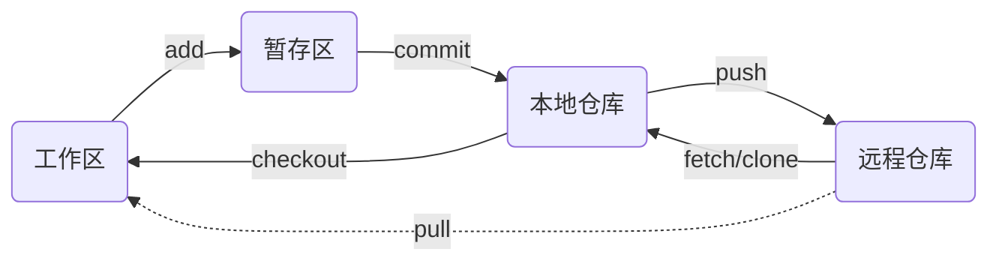

# ***我的计算机技术***

[toc]


## **编程**

**现代计算机大都是图灵机的物理实现，主流的冯诺伊曼结构的计算机硬件中，数据与指令保存在统一寻址的内存中，计算机程序通过自由组合与调度硬件资源实现功能，编程的本质就是规定调用硬件接口去读取数据与指令（算法）的方式**

> *“只有两种编程语言：大家抱怨的和没人用的。”	—	本贾尼·斯特劳斯特鲁普（Bjarne Stroustrup）*


### **编程范式**

**编程范式（programming paradigm），即编程风格。不同编程范式之间的根本区别之一，就是对状态（state）的处理。状态，是程序运行时其内部变量的值。全局状态（global state）是程序运行时其内部全局变量的值，常用的编程范式有过程式编程、函数式编程和面向对象编程。**

- **过程式编程，通过编写一系列步骤来解决问题，每步都是独立存在的，简明直接。编程时将数据存储在全局变量中，并且使用函数进行处理，其中状态都保存在全局变量中，每步都会改变程序的状态，所以随着程序越来越复杂，全局变量的数量也逐渐增加，再加上程序需要不断添加新的功能，也需要修改全局变量，程序很快会变得无法维护**
- **函数式编程源自 $\lambda$ 运算（数学家阿隆佐·邱奇发明的世界上最小的通用编程语言）不使用或不改变全局状态的函数，唯一使用的状态就是传给函数的参数。一个函数的结果通常被继续传给另一个函数。 因此，这些程序员通过函数之间传递状态，避免了全局状态的问题（通过全局方法可以改变全局状态）。简而言之，不依赖当前函数之外的数据，也不改变当前函数之外的数据，解决了过程式编程中出现的问题**
- **面向对象编程也是通过消除全局状态来解决过程式编程引发的问题，但并不是用函数，而是用对象来保存状态。在面向对象编程中，类定义了一系列相互之间可进行交互的对象。类中的代码主体可以是一个单一语句，或一个叫方法的复合语句。方法就是绑定在类中的函数。面向对象编程有多个优点，鼓励代码复用，从而减少了开发和维护的时间，还鼓励拆解问题，使代码更容易维护。也有一个缺点，编写程序要做很多的事前规划和设计**

**解决实际问题时需要综合考虑编程的效率、可维护性、可扩展性和可易移植性等多方面因素选择编程范式。参加数学建模比赛，目的是找到比赛场景中的规律通过编程将其映射到计算机中建立一个可行的模型解决相应问题，使用面向过程编程快速的将抽象的规律按照人的理解在计算机中实现即可，数学建模比赛小团队专事专办注重时效，反而而不必去使用面向对象编程写类绑定函数，去从硬件角度出发考虑底层实现使用非结构式编程，虽然最终也能解决问题但显然更没有必要，因此不必拘泥于形式**

> *“优良设计创造价值的速度，快于其增加成本的速度。”	—	托马斯·C.盖勒（Thomas C.Gale）*


#### **对象**

**不同编程范式的核心都是处理数据与指令，如果把数据与指令都看成对象，随着看待问题的视角不同与对象的定义不同，可将编程范式大体上划分为非结构式编程，面向过程编程，面向对象编程**


**在计算机的视角看待问题，其对象就是 CPU 与内存里的电路（计算机世界的基石）连通就是 1 断开就是 0，直接操作它们来表达二进制信息，其方式没有太多规律可言，其编程风格即非结构化编程。面向过程编程看待问题的视角介于人与计算机之间，注重编程的形式，其对象是数据与算法，代码可读性更强。面向对象编程是在人的视角看待问题，操作的对象是属性（数据）与方法（算法）的集合，人易于理解具有某些特点（属性）与能力（方法）的对象。**

**面向对象编程的对象需要实现封装、抽象、继承和多态等特性，核心手段是将问题分解为多个独立的对象进行有机组合解决问题。例如，计算两点间的直线距离，面向对象编程首先实现一个点对象与一个距离对象，然后调用两次点对象与一次距离对象计算两点间的直线距离，它不是最直接的方式，但是低耦合、易维护、易复用和易扩展**

> ***封装（encapsulation）**包含两个概念，第一个概念是在面向对象编程中，对象将变量（状态）与方法（用来改变状态或执行涉及状态的计算）集中在一个地方—即对象本身。封装包含的第二个概念，指的是隐藏类的内部数据，以避免客户端代码（即类外部的代码）直接进行访问。换句话说，就是利用抽象数据类型将数据和基于数据的操作组合一起，构成一个不可分割的独立实体，数据被保护在抽象数据类型的内部，只保留一些对外接口与外部联系。系统的其他对象只能通过包裹在数据外面的已经授权的操作来与这个封装的对象进行交互。用户是无需知道对象内部的细节，但可以通过该对象对外的提供的接口来访问该对象，良好的封装能够减少耦合，隐藏信息*
>
> ***抽象（abstraction）**指的是“剥离事物的诸多特征，使其只保留最基本的特质”的过程。假设要对人进行建模。人的特征很复杂，头发和眼睛颜色不同，还有身高、体重、 种族、性别等诸多特征。如要创建一个类代表人，有一些细节可能与要解决的问题并不相关。举个例子，我们创建一个 Person 类，但是忽略其眼睛颜色和身高等特征，这就是在进行抽象。Person 对象是对人的抽象，代表的是只具备解决当前问题所需的基本特征的人。*
>
> ***继承（inheritance）**在创建类时，该类也可以从另一个类那里继承方法和变量，可以避免重复性的封装，使用已存在的类的定义作为基础建立新类，新类的定义可以增加新的属性或新的方法，且拥有父类非私有的属性与方法，子类可以用自己的方式实现父类的方法*
>
> ***多态（polymorphism）**是“为不同的基础形态（数据类型）提供相关接口（函数或方法）的能力”。是对继承功能的优化，即程序中定义的引用变量所指向的具体类型与通过该引用变量发出的方法调用在编程时并不确定，而是在程序运行期间才确定，让程序具有多个运行状态，例如字符串的加法和整数的加法，同样是加法，功能确不同*


### **编程实现**

**不论何种编程范式都需要使用顺序与跳转两类编程手段去分解实际问题背后的复杂逻辑并通过封装与调用对象逐步的编程解决实际问题**


**编程实现的过程需要不断的封装与调用对象，封装通常包含三个层面，全局封装即承载编程语言的外壳，系统封装即编程语言自带的不允许更改的属性与方法，局部封装即自定义的属性与方法且可以嵌套，调用对象同上，每一个层面都有自己的命名空间（Namespace），可以声明变量去实例化对象，与当前空间没有连接的对象则需要先开辟通道导入至与当前空间有连接的任何空间才可调用，全局（Global）空间与系统（Built-in）空间始终和局部空间相连，但是局部空间之间却往往不相连，另外嵌套时如果局部封装中嵌套了局部封装那么对于里层的局部封装和程序的全局封装来讲，外层的局部封装的变量空间就是通常说的即非局部（Nonlocal）或闭包（Enlocal）空间**


**编程后需要让计算机执行，计算机的硬件与系统决定了只能执行二进制数组成的机器码，因此需要将写好的程序转转换成这些机器码，这一过程需要一个转换器（事先定义了从一种语言体系到另一种语言体系转换规则的装置）来实现，汇编语言的符号与机器码几乎是一一对应仅需要一个表查表即可，常用的高级编程语言与机器码间的非常复杂，发展出来不同的转换器即编译器与解释器，编译器是静态的，先编译整个程序成机器码然后再执行整个程序，解释器是动态的，需要执行程序中的哪一句就解释一句成机器码**


## **进程与线程**

**进程是操作系统资源分配的最小单位，线程是 CPU 调度的最小单位，都分为五个阶段，创建、就绪、运行、阻塞和终止**

**计算机硬件的工作模式**


**CPU（central processing unit，中央处理器）由运算器和控制器组成，有以下几个重点模块**

> *ALU（arithmetic and logic unit，算术逻辑单元）用于计算*
>
> *CU（Control Unit，控制单元）负责程序的流程管理，从内存取指令、分析指令和执行指令*
>
> *MMU（Memory Management Unit，内存管理单元）一种负责处理中央处理器（CPU）的内存访问请求的计算机硬件，完成虚拟地址到硬件地址的映射* 
>
> *Register（寄存器）存放数据的一些小型存储区域，用来暂时存放参与运算的数据和运算结果* 
>
> *Cache（高速缓冲存储器）用于内存和cpu之间的数据交互*
>
> *PC（Program Counter，程序计数器）存放下一条要执行指令的地址*

**Bus（总线）组成 CPU 和其他设备的高速通道**

**RAM（内存存储介质）保存 CPU 计算的中间结果**

**其他外部输入输出设备，如 USB（鼠标/键盘）、PCIE（显卡/显示器）、ROM（磁盘控制器/磁盘）和 WIFI（网卡）等**


### **故事的开始**

**内存的每一个空间都有地址，当需要运行程序时，操作系统调用 CPU 把程序从硬盘读入内存，创建一个可执行的程序实例即进程，程序占用的内存地址被组织成具有独立虚拟地址的内存空间，在进程内通过虚拟地址可以快速访问每一块内存，通过跨进程通信技术也能实现不同进程间的通信但是会更慢。每个进程通常有一个程序计数器记录当前程序的执行的位置，还会分配寄存器和堆栈顺序执行，它们共同构成的执行流是线程，一个进程内可以有多个线程，进程内的虚拟地址和全局变量等是全部线程共享的，对于一个 CPU 核心在一个时间片（和晶振频率正相关）内只能执行一个线程，因此一个进程中的多个线程是轮流执行，等待 CPU 执行时线程就是处于就绪阶段，CPU 执行中线程就是处于运行阶段，如果此时执行的程序请求访问硬盘耗时将远超一个时间片（IO 等待）于是 CPU 就会陷入空转此时线程就是处于阻塞阶段，紧接着 CPU 就会转而执行其它就绪的线程直到阻塞的线程访问硬盘结束继续执行，如果具有多个 CPU 核心确实可以实现多个线程同时并行计算**

**每个进程都有独立的内存空间（进程上下文），进程切换开销大，一个进程可以包含 1 到 n 个线程，一进程的各个线程不仅有自己的寄存器和堆栈还共享代虚拟地址和全局变量，线程切换开销小，相比于进程细粒度更高**


### **故事的结束**

**线程具有许多传统进程所具有的特征，故又称为轻型进程（Light Weight Process）或进程元；而把传统的进程称为重型进程（Heavy Weight Process）相当于只有一个线程的任务**

**每个独立的进程有程序运行的入口、顺序执行序列和程序运行的出口。但是线程不能独立执行，必须依存在应用程序中，由应用程序提供多个线程执行控制，两者均可并发**

**一个进程崩溃后，在保护模式下不会对其他进程产生影响，但是一个线程崩溃整个进程都死掉，所以多进程要比多线程健壮**


### **多进程与多线程**

**多进程指操作系统能同时运行多个任务（程序），多线程指同一程序中有多个顺序流在执行（功能）**

**多线程可以提高程序运行速度，其本质是提高对 CPU 的利用率，程序阻塞等待时充分利用 CPU 减少 CPU 空转，如果部分线程发生阻塞，另一部分线程则仍能继续使用 CPU，因此程序中没有上下文关系的片段可以使用不同线程分别执行从而提高程序运行速度**

**多线程并不一定能提高程序运行速度，盲目创建大量线程来并发反而会降低程序运行速度。因为在多个线程进行切换执行的时候会带来开销。其中有线程切换、CPU 调度线程、线程创建和终止等开销。其中主要是线程切换时保存上一个线程现场和载入下一个线程现场的操作，即上下文切换**

**以上都可以通过多进程技术实现，但是创建与终止进程（分配和释放独立的内存空间），进程间通信与切换等开销都会大的多**

**其中，进程间通信就是在不同进程之间进行数据交流，主要包括管道、系统 IPC 和 Socket 等**

- **管道，一种半双工的通信方式，数据只能单项流动，并且只能在具有亲缘关系的进程间流动（进程的亲缘关系通常是父子进程，命名管道也是半双工的通信方式，但允许无亲缘关系进程间通信）**

- **系统 IPC（Inter-Process Communication）主要用于大量数据交换**

  > *包括消息队列，是消息的链表，存放在内核中并由消息队列标识符标识*
  >
  > *共享内存，映射一段能够被其他进程访问的内存，其由一个内存创建可以被多个进程访问*

- **Socket，用于不同进程间的进程通信（比如利用IP和端口发送、接收数据）**


## **C/C++编译与VSCode配置**

**主流的编译器有 GUN 大名鼎鼎的类 UNIX 系统下的编译器 gcc、gcc 的 windows 的移植版 mingw、微软的 MSVC（对新标准支持的少）和苹果的 clang 等，不同编译器的使用区别主要是所支持的 C/C++ 语言标准不同**


### **C/C++编译**

**GCC 编译 hello.c 文件，分四步完成编译（G++ 编译 hello.cpp 同理）**


- **预处理** **gcc -E hello.c -o hello.i，不检查语法错误，将C文件转为预处理文件**

  > ***将头文件拷贝至源文件（头文件展开）、处理所有的条件预编译指令、丢弃注释和宏替换等*** 


- **编译** **gcc -S hello.i -o hello.s，检查语法错误，将预处理文件转为汇编文件**

  > ***将预处理完的.i文件进行一系列的词法分析、语法分析、语义分析及优化后生成响应的汇编代码文件，这是整个程序构建的最核心的部分，也是最复杂的部分***


- **汇编** **gcc -c hello.s -o hello.o，将汇编文件转为二进制文件**

  > ***将编译生成的.o文件编程机器可执行的指令，每一个汇编语句几乎都对应一条机器指令***


- **链接** **gcc hello.o -o hello，链接动态库与静态库，设置运行环境**


- **gcc -g hello.c -o hello，可直接实现上述四步编译**


|  参数名  |          **含义**           |
| :------: | :-------------------------: |
| **`-E`** |         **预处理**          |
| **`-S`** |          **编译**           |
| **`-c`** |          **汇编**           |
| **`-g`** | **编译保留gbd调试相关信息** |
| **`-o`** |     **指定输出文件名**      |
| **`.c`** |        **C语言文件**        |
| **`.i`** |   **预处理后的C语言文件**   |
| **`.s`** |        **汇编文件**         |
| **`.o`** |        **目标文件**         |


### **VSCode配置**

**VSCode是一个编辑器，配合插件才能搭建一个集成开发环境，因此需要配置文件实现联动，对于C与CPP是四个配置文件（它们分别包括用户和工作区两种，作用域上用户是全局的而工作区只用于当前，优先级上工作区设置会覆盖用户设置）**


#### **settings.json**

**VSCode 的方方面面基本都能在其中配置，如插件 Code Runner 等的配置**

```json
{ 
    "code-runner.runInTerminal": true, // 设置成false会在“输出”中输出，无法输入
    "code-runner.executorMap": {
        "c": "cd $dir && clang '$fileName' -o '$fileNameWithoutExt.exe' -Wall -g -O2 -static-libgcc --target=x86_64-w64-mingw -std=c11 && &'$dir$fileNameWithoutExt'",
        "cpp": "cd $dir && clang++ '$fileName' -o '$fileNameWithoutExt.exe' -Wall -g -O2 -static-libgcc --target=x86_64-w64-mingw -std=c++17 && &'$dir$fileNameWithoutExt'"
    },
    "code-runner.saveFileBeforeRun": true, // run code前保存
    "code-runner.preserveFocus": true, // 若为false，run code后光标会聚焦到终端上
    "code-runner.clearPreviousOutput": false, // 每次run code前清空属于code runner的终端消息
    "code-runner.ignoreSelection": true, // 默认为false，效果是鼠标选中一块代码后可以单独执行，但C是编译型语言，不适合这样用

    "clang.cflags": [ // 控制c语言静态检测的参数
        "--target=x86_64-w64-mingw",
        "-std=c17",
        "-Wall"
    ],
    "clang.cxxflags": [ // 控制c++静态检测时的参数
        "--target=x86_64-w64-mingw",
        "-std=c++98",
        "-Wall"
    ],
}
```


#### **c_cpp_properties.json**

**用于编程时的智能感知，配置编译器路径，C与CPP的标准等，通常使用默认的设置即可，如果你自己编写了头文件又不在workspaceFolder下，或是使用别人的库，就需要将这些路径加到includePath和browse里**

```json
{
    "configurations": [
        {
            "name": "MinGW",
            "intelliSenseMode": "gcc-x64",
            "compilerPath": "C:/LLVM/bin/gcc.exe",
            "includePath": [
                "${workspaceFolder}"
            ],
            "defines": [],
            "browse": {
                "path": [
                    "${workspaceFolder}"
                ],
                "limitSymbolsToIncludedHeaders": true,
                "databaseFilename": ""
            },
            "cStandard": "c17",
            "cppStandard": "c++98"
        }
    ],
    "version": 4
}
```


#### **tasks.json**

**用于配置任务，比如配置编译，因为C与CPP编译后才能进行调试等操作**

```json
// https://code.visualstudio.com/docs/editor/tasks
{
    "version": "2.0.0",
    "tasks": [
        {
            "label": "C/C++生成活动文件", // 任务名称，与launch.json的preLaunchTask相对应
          	"type": "cppbuild", // 也可指定shell则命令被解释为如bash、cmd 和PowerShell等命令，或者指定process则命令被解释为要执行的进程
            "command": "gcc", // 实际要执行的命令，C还可选择clang，C++用clang++,g++
            "args": [
                "${file}",
                "-o", // 指定输出文件名，不加参数Windows默认a.exe，Linux下默认a.out
                "${fileDirname}/${fileBasenameNoExtension}.exe",
                "-g", // 生成和调试有关的信息使得编译后可以使用gdb调试
                "-Wall", // 开启额外警告
                "-static-libgcc", // 静态链接libgcc
                "--target=x86_64-w64-mingw", // 不加这一条就会找不到头文件
                "-std=c17" // 根据自己的需要的标准进行修改
            ], // 编译命令参数
            "group": {
                "kind": "build", // 定义任务所属的组，build 是构建组
                "isDefault": true // 设为false可做到一个tasks.json配置多个编译指令
            },
            "presentation": {
                "echo": true,
                "reveal": "always", // 在终端中显示编译信息的策略，可以为always，silent，never
                "focus": false, // 设为true后可以使执行task时焦点聚集在终端
                "panel": "shared" // 不同的文件的编译信息共享一个终端面板，可以设为new
            }
        }
    ]
}
```


#### **launch.json**

**用于调试的配置文件，可以有多个配置块，每个块都可以用于指定一个调试语言环境与类型等，每个中必须配置type、request和name这三项（不管用什么编程环境都必须配置）**

- **type，指定编程环境，比如c、cpp、java、python和node等**

- **request，指定调试模式，VSCode只有launch与attach**

  > ***以launch方式启动的时候VSCode直接从本地项目启动并自动添加一个调试器；以attach方式启动，通常需要调试一个已经在跑的项目（web服务）且可能是在远程或者在本地但是重启速度很慢的项目，因为项目在远程上不好打断点，但是可以通过attach启动的方式在这个远程的服务外面包裹一层调试器，间接达到调试的目的***

- **name，定义调试的名字**

- **调试工具有gdb（GUN）、msvcdbg（微软）和lldb（苹果）等**

```json
// https://github.com/Microsoft/vscode-cpptools/blob/master/launch.md
{
    "version": "0.2.0",
    "configurations": [
        {
            "name": "gdbdebug", // 配置名称，将会在启动配置的下拉菜单中显示
            "type": "gdb", // 配置类型
            "request": "launch", // 请求配置类型可以为launch或attach
            "program": "${fileDirname}/${fileBasenameNoExtension}.exe", // 将要进行调试的程序的路径
            "args": [], // 程序调试时传递给程序的命令行参数，一般设为空即可
            "stopAtEntry": false, // 设为true时程序将暂停在程序入口处，相当于在main上打断点
            "cwd": "${workspaceFolder}", // 调试程序时的工作目录，此为工作区文件夹；改成${fileDirname}可变为文件所在目录
            "environment": [], // 环境变量
            "externalConsole": true, // 为true时使用单独的cmd窗口
            "internalConsoleOptions": "neverOpen", // 如果不设为neverOpen，调试时会跳到“调试控制台”选项卡
            "MIMode": "gdb", // 指定连接的调试器
            "miDebuggerPath": "gdb.exe", // 调试器路径
            "setupCommands": [
                {
                    "description": "Enable pretty-printing for gdb",
                    "text": "-enable-pretty-printing",
                    "ignoreFailures": false
                }
            ],
            "preLaunchTask": "C/C++生成活动文件" // 调试会话开始前执行的任务，一般为编译程序，与tasks.json的label相对应
        }
    ]
}
```


#### **VSCode中预定义变量名的含义**

|            **变量名**            |                       **含义**                        |
| :------------------------------: | :---------------------------------------------------: |
|      **`${workspaceRoot}`**      |      **当前打开的文件夹的绝对路径+文件夹的名字**      |
| **`${workspaceRootFolderName}`** |              **当前打开的文件夹的名字**               |
|          **`${file}`**           |              **当前打开文件的绝对路径**               |
|      **`${relativeFile}`**       |   **从当前打开的文件夹到当前打开的文件的相对路径**    |
|     **`${workspaceFolder}`**     |              **当前工作区的文件夹路径**               |
|      **`${fileBasename}`**       |       **当前打开的文件名加后缀名，不包括路径**        |
| **`${fileBasenameNoExtension}`** |    **当前打开的文件的文件名，不包括路径和后缀名**     |
|       **`${fileDirname}`**       |    **当前打开的文件所在的绝对路径，不包括文件名**     |
|       **`${fileExtname}`**       |              **当前打开的文件的后缀名**               |
|           **`${cwd}`**           |           **任务开始运行时的当前工作目录**            |
|       **`${lineNumber}`**        |          **当前打开的文件，光标所在的行数**           |
|             **`/*`**             |               **拦截当前的全部文件夹**                |
|            **`/**`**             | **`/*` 的递归，拦截当前的全部文件夹和全部的子文件夹** |


#### **CMake构建Makefile实现编译**

**CMake 是一个跨平台、开源的构建系统，是集软件构建、测试、打包于一身的软件，使用与平台和编译器独立的配置文件对软件编译过程进行控制**


##### **CMake前言**

**Make 是工程管理器，可以解释 Makefile 中指令的命令工具，通过读入 Makefile 文件的内容来实现自动化编译，并且能够根据文件时间戳自动发现更新过的文件而只编译改动的代码文件，而不用每次都全部编译**

**Makefile 关系到了整个工程的编译规则，一个工程中的源文件不计其数，并且按类型、功能和模块分别放在若干个目录中，Makefile 定义了一系列的规则来指定，哪些文件需要先编译，哪些文件需要后编译，哪些文件需要重新编译，甚至于进行更复杂的功能操作，Makefile 很像一个 Shell 脚本，可以执行操作系统的命令**

**有许多 Make 工程管理器，如 GNU Make、QT 的 qmake、微软的 MS nmake、BSD Make、Makepp 等。这些 Make 工具遵循着不同的规范和标准，所执行的 Makefile 格式也千差万别，如果使用上面的 Make 工具，就得为每一种标准写一次 Makefile**

**CMake就是针对上面问题所设计的工具，它首先允许开发者编写一种平台无关的 CMakeLists.txt 文件来设置整个编译流程，然后再根据目标用户的平台进一步生成所需的本地化Makefile和工程文件，如Unix的Makefile或Windows的Visual Studio工程，从而做到一次编写到处运行，一些使用CMake作为项目架构系统的知名开源项目有VTK、ITK、KDE、OpenCV、OSG等**


##### **CMake命令**

**CMake 命令一般格式 `command(<target> [E] A|B|C) ` 参数间空格隔开；尖括号 `<>` 必选变量；`<target>`；方括号 `[]` 可选变量 `[E]`；竖线 `|` 或 `A|B|C`；通过 `${<变量>}` 引用变量**

**CMake 预定义了一些变量**

- `PROJECT_SOURCE_DIR` 工程的根目录
- `PROJECT_BINARY_DIR` 运行CMake命令的目录，默认是 `${PROJECT_SOURCE_DIR}/build`
- `CMAKE_INCLUDE_PATH` 环境变量
- `CMAKE_LIBRARY_PATH` 环境变量
- `CMAKE_C_COMPILER` C 编译器；`CMAKE_CXX_COMPILER` C++ 编译器
- `CMAKE_C_STANDARD` C 标准；`CMAKE_C_STANDARD` C++ 标准
- `CMAKE_CURRENT_SOURCE_DIR` 当前处理的 `CMakeLists.txt` 所在的路径
- `CMAKE_CURRENT_BINARY_DIR` 目标编译目录；`SET(EXECUTABLE_OUTPUT_PATH 自定义路径)` 重新定义目标二进制可执行文件的存放位置，不会影响此变量，只是改变最终目标文件的存储路径
- `LIBRARY_OUTPUT_PATH` 重新定义目标链接库文件的存放位置
- `SET(CMAKE_MODULE_PATH ${PROJECT_SOURCE_DIR}/cmake)`，可以使用 `include` 命令调用文件或模块的 CMake 代码

**CMake 的常用命令**

|                         命令                         |                             描述                             |
| :--------------------------------------------------: | :----------------------------------------------------------: |
|    **`cmake_minimum_required(VERSION <版本号>)`**    |                   **指定 CMake 最低版本**                    |
|            **`project(<工程名字变量>)`**             |            **指定项目名字赋给 `PROJECT_NAME` 中**            |
|      **`set(<变量> [值一] [值二]...[值某某])`**      |                 **设置变量并赋值且可赋多值**                 |
|               **`message(<变量|值>)`**               |                         **输出信息**                         |
|    **`add_definitions(-D<变量> -D<变量>=<值>)`**     |                        **增加宏定义**                        |
|      **`option(<变量> "<help_text>" ON|OFF)`**       |                       **设置编译开关**                       |
|              **`enable_language(ASM)`**              |                     **添加汇编文件支持**                     |
|      **`aux_source_directory(<路径> <变量>)`**       |           **把路径中的所有源文件的全路径赋给变量**           |
|    **`file(GLOB <变量> "<源文件路径>/*.h|*.c"`**     | **通过匹配 globbing 表达式把路径中匹配的文件全路径赋给变量** |
| **`add_library(<变量> SHARED|STATIC <源文件名字>)`** |                    **生成动态库或静态库**                    |
|          **`include_directories(<路径>)`**           |                **提供了一个搜索头文件的目录**                |
|      **`find_library(<变量> <库名字> <路径>)`**      |          **从指定路径搜索库名字并把全路径赋给变量**          |
|        **`find_package(<包名字> REQUIRED)`**         |              **用于搜索外部库且设置为必须找到**              |
|   **`target_link_libraries(<目标名字> <库名字>)`**   |          **给目标链接依赖的静态库或动态库可以传递**          |
|      **`add_executable(<目标名字> <源文件>)`**       |                      **生成可执行文件**                      |

##### **CMake举例**

**一个工程文件夹 VSCode 中的项目 0319 文件夹中分别有 1 与 2 两个文件夹包含源文件作为各自独立脚本**


- **编程 CMakeLists.txts 与项目 0319 文件夹放在同级目录）**

```txt
# 设置CMake的版本号
cmake_minimum_required(VERSION 3.20)

# 设置项目名字
project(Code1)
project(Code1)

# 设置项目的编程语言的标准和编译器
set(CMAKE_C_STANDARD 17)
set(CMAKE_CXX_STANDARD 98)
set(CMAKE_C_COMPILER "gcc")
set(CMAKE_CXX_COMPILER "g++")

# 可以通过匹配globbing表达式设置源文件路径
# file(GLOB SRC_FILES
# 	"${PROJECT_SOURCE_DIR}/src/*.h"
# 	"${PROJECT_SOURCE DIR}/src/*.cpp"
# 	"${PROJECT_SOURCE DIR}/src/*.c"
# 	"${PROJECT_SOURCE DIR}/src/*.cc")

# 设置源文件路径
aux_source_directory(0319/1 CFile1)
aux_source_directory(0319/2 CFile2)

# 设置项目的需要执行的源文件
add_executable(Code1 ${CFile1})
add_executable(Code2 ${CFile2})
```

- **通过 CMake 执行 CMakeLists.txts 构建 Makefile 与项目编译**

  > ***在 VSCode 终端执行 mkdir CMakeBuild 创建文件夹，再 cd CMakeBuild 进入并执行 cmake .. 对上层文件夹构建 Makefile 并与源码分离存储在 CMakeBuild 中（CMakeLists.txt 所在目录一般在根目录下，直接运行 cmake .构建 Makefile 中间文件将会和源文件混杂此时最好在 CMakeLists.txt 编程一些自动化移动逻辑管理好项目树）接着执行 make 批处理源文件完成编译*** 


## **正则表达式**

### **字符**

| **表达式** | **描述**                                              |
| ---------- | ----------------------------------------------------- |
| `[abc]`    | 字符集，匹配集合中所含的任一字符                      |
| `[^abc]`   | 否定字符集，匹配任何不在集合中的字符                  |
| `[a-z]`    | 字符范围，匹配指定范围内的任意字符                    |
| `.`        | 匹配除换行符以外的任何单个字符                        |
| `\`        | 转义字符                                              |
| `\w`       | 匹配任何字母数字，包括下划线（等价于 `[A-Za-z0-9_]`） |
| `\W`       | 匹配任何非字母数字（等价于 `[^A-Za-z0-9_]`）          |
| `\d`       | 数字，匹配任何数字                                    |
| `\D`       | 非数字，匹配任何非数字字符                            |
| `\s`       | 空白，匹配任何空白字符，包括空格、制表符等            |
| `\S`       | 非空白，匹配任何非空白字符                            |


### **分组与引用**

| **表达式**       | **描述**                                                     |
| ---------------- | ------------------------------------------------------------ |
| `(expression)`   | 分组，匹配括号里的整个表达式                                 |
| `(?:expression)` | 非捕获分组，匹配括号里的整个字符串但不获取匹配结果，拿不到分组引用 |
| `\num`           | 对前面所匹配分组的引用，第一个分组就是 `\1` 第二个分组就是 `\2` 以此类推，比如 `(\d)\1` 可以匹配两个相同的数字，`(Hao)(DaXia)\1\2` 则可以匹配 `HaoDaXiaHaoDaXia` |


### **锚点/边界**

| **表达式** | **描述**                                                     |
| ---------- | ------------------------------------------------------------ |
| `^`        | 匹配字符串或行开头                                           |
| `$`        | 匹配字符串或行结尾                                           |
| `\b`       | 匹配单词边界，比如 `DaXia\b` 可以匹配 `HaoDaXia` 末尾的 `DaXia`，不能匹配 `HaoDaXiaHao` 中的 `DaXia` |
| `\B`       | 匹配非单词边界，比如 `Hao\B` 可以匹配 `HelloHaoDaXia` 中的 `Hao`，不能匹配 `HelloHao` 中的 `Hao` |


### **数量表示**

| **表达式** | **描述**                                   |
| ---------- | ------------------------------------------ |
| `?`        | 匹配前面的表达式 0 个或 1 个，即表示可选项 |
| `+`        | 匹配前面的表达式至少 1 个                  |
| `*`        | 匹配前面的表达式 0 个或多个                |
| `|`        | 或运算符，并集，可以匹配符号前后的表达式   |
| `{m}`      | 匹配前面的表达式 m 个                      |
| `{m,}`     | 匹配前面的表达式最少 m 个                  |
| `{m,n}`    | 匹配前面的表达式最少 m 个，最多 n 个       |


### **预查断言**

| **表达式** | **描述**                                                     |
| ---------- | ------------------------------------------------------------ |
| `(?=)`     | 正向预查，比如 `Hao(?=DaXia)` 能匹配 `HaoDaXia` 中的 `Hao`，但不能匹配 `HaoXiaoXia` 中的 `Hao` |
| `(?!)`     | 正向否定预查，比如 `Hao(?!=DaXia)` 不能匹配 `HaoDaXia` 中的 `Hao`，但能匹配 `HaoXiaoXia` 中的 `Hao` |
| `(?<=)`    | 反向预查，比如 `(?<=Hao)DaXia` 能匹配 `HaoDaXia` 中的 `DaXia`，但不能匹配 `HuDaXia` 中的 `DaXia` |
| `(?<!)`    | 反向否定预查，比如 `(?<!Hao)DaXia` 不能匹配 `HaoDaXia` 中的 `DaXia`，但能匹配 `HuDaXia` 中的 `DaXia` |


### **特殊标志**

| **表达式** | **描述**                 |
| ---------- | ------------------------ |
| `/.../i`   | 忽略大小写               |
| `/.../g`   | 全局匹配                 |
| `/.../m`   | 多行修饰符，用于多行匹配 |


### **常用示例**

- **1. 数字校验**

| **描述**       | **正则表达式**                                    | **备注**                      |
| -------------- | ------------------------------------------------- | ----------------------------- |
| 数字           | `^[0-9]*$`                                        |                               |
| n 位数字       | `^\d{n}$`                                         |                               |
| 至少 n 位数字  | `^\d{n,}$`                                        |                               |
| m~n 位数字     | `^\d{m,n}$`                                       |                               |
| 整数           | `^(-?[1-9]\d*)$`                                  | 非 0 开头，包括正整数和负整数 |
| 正整数         | `^[1-9]\d*$`                                      |                               |
| 负整数         | `^-[1-9]\d*$`                                     |                               |
| 非负整数       | `^(([1-9]\d*)|0)$`                                |                               |
| 非正整数       | `^((-[1-9]\d*)|0)$`                               |                               |
| 浮点数         | `^-?(?:[1-9]\d*\.\d*|0\.\d*[1-9]\d*|0\.0+|0)$`    | 包括正浮点数和负浮点数        |
| 正浮点数       | `^(?:[1-9]\d*\.\d*|0\.\d*[1-9]\d*)$`              |                               |
| 负浮点数       | `^-(?:[1-9]\d*\.\d*|0\.\d*[1-9]\d*)$`             |                               |
| 非正浮点数     | `^(?:-(?:[1-9]\d*\.\d+|0\.\d*[1-9]\d*)|0\.0+|0)$` | 包含 0                        |
| 非负浮点数     | `^(?:[1-9]\d*\.\d+|0\.\d+|0\.0+|0)$`              | 包含 0                        |
| 仅一位小数     | `^-?(?:0|[1-9][0-9]*)\.[0-9]{1}$`                 |                               |
| 最少一位小数   | `^-?(?:0|[1-9][0-9]*)\.[0-9]{1,}$`                |                               |
| 最多两位小数   | `^-?(?:0|[1-9][0-9]*)\.[0-9]{1,2}$`               |                               |
| 连续重复的数字 | `^(\d)\1+$`                                       | 例如 `111 ` `222`             |


- **2. 字符校验**

| **描述**                             | **正则表达式**                  | **备注**         |
| ------------------------------------ | ------------------------------- | ---------------- |
| 中文                                 | `^[\u4E00-\u9FA5]+$`            |                  |
| 全角字符                             | `^[\uFF00-\uFFFF]+$`            |                  |
| 半角字符                             | `^[\u0000-\u00FF]+$`            |                  |
| 英文字符串（大写）                   | `^[A-Z]+$`                      |                  |
| 英文字符串（小写）                   | `^[a-z]+$`                      |                  |
| 英文字符串（不区分大小写）           | `^[A-Za-z]+$`                   |                  |
| 中文和数字                           | `^(?:[\u4E00-\u9FA5]{0,}|\d)+$` |                  |
| 英文和数字                           | `^[A-Za-z0-9]+$`                |                  |
| 数字、英文字母或者下划线组成的字符串 | `^\w+$`                         |                  |
| 中文、英文、数字包括下划线           | `^[\u4E00-\u9FA5\w]+$`          |                  |
| 不含字母的字符串                     | `^[^A-Za-z]*$`                  |                  |
| 连续重复的字符串                     | `^(.)\1+$`                      | 例如 `aa` `bb`   |
| 长度为n的字符串                      | `^.{n}$`                        |                  |
| ASCII                                | `^[ -~]$`                       | 从空字符到波浪线 |


- **3. 日期和时间校验**

| **描述**   | **正则表达式**                                               | **备注**                   |
| ---------- | ------------------------------------------------------------ | -------------------------- |
| 日期       | `^\d{1,4}-(?:1[0-2]|0?[1-9])-(?:0?[1-9]|[1-2]\d|30|31)$`     | 弱校验，例如  `2022-06-12` |
| 日期       | `^(?:(?!0000)[0-9]{4}-(?:(?:0[1-9]|1[0-2])-(?:0[1-9]|1[0-9]|2[0-8])|(?:0[13-9]|1[0-2])-(?:29|30)|(?:0[13578]|1[02])-31)|(?:[0-9]{2}(?:0[48]|[2468][048]|[13579][26])|(?:0[48]|[2468][048]|[13579][26])00)-02-29)$` | 严格校验，考虑平闰年       |
| 时间       | `^(?:1[0-2]|0?[1-9]):[0-5]\d:[0-5]\d$`                       | 12小时制，例如 `11:21:31`  |
| 时间       | `^(?:[01]\d|2[0-3]):[0-5]\d:[0-5]\d$`                        | 24小时制，例如 `23:21:31`  |
| 日期与时间 | `^(\d{1,4}-(?:1[0-2]|0?[1-9])-(?:0?[1-9]|[1-2]\d|30|31)) ((?:[01]\d|2[0-3]):[0-5]\d:[0-5]\d)$` | 例如 `2000-11-11 23:20:21` |


- **4. 日常生活相关**

| **描述**         | **正则表达式**                                               | **备注**                                                     |
| ---------------- | ------------------------------------------------------------ | ------------------------------------------------------------ |
| 中文名           | `^[\u4E00-\u9FA5·]{2,16}$`                                   |                                                              |
| 英文名           | `^[a-zA-Z][a-zA-Z\s]{0,20}[a-zA-Z]$`                         |                                                              |
| 车牌号           | `^[京津沪渝冀豫云辽黑湘皖鲁新苏浙赣鄂桂甘晋蒙陕吉闽贵粤青藏川宁琼使领][A-HJ-NP-Z][A-HJ-NP-Z0-9]{4}[A-HJ-NP-Z0-9挂学警港澳]$` | 不含新能源                                                   |
| 车牌号           | `^[京津沪渝冀豫云辽黑湘皖鲁新苏浙赣鄂桂甘晋蒙陕吉闽贵粤青藏川宁琼使领][A-HJ-NP-Z](?:(?:[A-HJ-NP-Z0-9]{4}[A-HJ-NP-Z0-9挂学警港澳])|(?:(?:\d{5}[A-HJK])|(?:[A-HJK][A-HJ-NP-Z0-9][0-9]{4})))$` | 包含新能源                                                   |
| 火车车次         | `^[GCDZTSPKXLY1-9]\d{1,4}$`                                  | 例如 `G1234`                                                 |
| 手机号           | `^(?:(?:\+|00)86)?1[3-9]\d{9}$`                              | 弱匹配                                                       |
| 手机号           | `^(?:(?:\+|00)86)?1(?:(?:3[\d])|(?:4[5-79])|(?:5[0-35-9])|(?:6[5-7])|(?:7[0-8])|(?:8[\d])|(?:9[189]))\d{8}$` | 严格匹配                                                     |
| 固话号码         | `^(?:(?:\d{3}-)?\d{8}|^(?:\d{4}-)?\d{7,8})(?:-\d+)?$`        |                                                              |
| 手机 IMEI 码     | `^\d{15,17}$`                                                | 一般是 15 位                                                 |
| 邮编             | `^(?:0[1-7]|1[0-356]|2[0-7]|3[0-6]|4[0-7]|5[1-7]|6[1-7]|7[0-5]|8[013-6])\d{4}$` | 例如 `211100`                                                |
| 统一社会信用代码 | `^[0-9A-HJ-NPQRTUWXY]{2}\d{6}[0-9A-HJ-NPQRTUWXY]{10}$`       |                                                              |
| 身份证号码(1代)  | `^[1-9]\d{7}(?:0\d|10|11|12)(?:0[1-9]|[1-2][\d]|30|31)\d{3}$` | 15 位数字                                                    |
| 身份证号码(2代)  | `^[1-9]\d{5}(?:18|19|20)\d{2}(?:0[1-9]|10|11|12)(?:0[1-9]|[1-2]\d|30|31)\d{3}[0-9Xx]$` | 18 位数字                                                    |
| QQ号             | `^[1-9][0-9]{4,}$`                                           | 一般是 5 到 10 位                                            |
| 微信号           | `^[a-zA-Z][-_a-zA-Z0-9]{5,19}$`                              | 一般 6~20 位，字母开头，可包含字母、数字、-、_，不含特殊字符 |
| 股票代码         | `^(s[hz]|S[HZ])(000[\d]{3}|002[\d]{3}|300[\d]{3}|600[\d]{3}|60[\d]{4})$` | A 股，例如 `600519`                                          |
| 银行卡卡号       | `^[1-9]{1}(?:\d{15}|\d{18})$`                                | 一般为 19 位                                                 |


- **5. 互联网相关**

| **描述**             | **正则表达式**                                               | **备注**                                                     |
| -------------------- | ------------------------------------------------------------ | ------------------------------------------------------------ |
| 域名                 | `^[a-zA-Z0-9][-a-zA-Z0-9]{0,62}(?:\.[a-zA-Z0-9][-a-zA-Z0-9]{0,62})+$` | 例如 `baidu.com`                                             |
| 网址                 | `^(?:https?:\/\/)?[a-zA-Z0-9][-a-zA-Z0-9]{0,62}(?:\.[a-zA-Z0-9][-a-zA-Z0-9]{0,62})+$` | 例如 `https://www.baidu.com/`                                |
| 带端口号的网址(或IP) | `^(?:https?:\/\/)?[\w-]+(?:\.[\w-]+)+:\d{1,5}\/?$`           | 例如 `http://127.0.0.1:8888/`                                |
| URL                  | `^https?:\/\/(?:www\.)?[-a-zA-Z0-9@:%._\+~#=]{1,256}\.[a-zA-Z0-9()]{1,6}\b(?:[-a-zA-Z0-9()!@:%_\+.~#?&\/\/=]*)$` | 例如 `https://www.baidu.com/my/index`                        |
| 邮箱 email           | `^[A-Za-z0-9\u4e00-\u9fa5]+@[a-zA-Z0-9][-a-zA-Z0-9]{0,62}(?:\.[a-zA-Z0-9][-a-zA-Z0-9]{0,62})+$` | 支持中文，例如 `haodaxia@cs.com`                             |
| 用户名               | `^[a-zA-Z0-9_-]{4,20}$`                                      | 4 到 20 位                                                   |
| 弱密码               | `^[\w]{6,16}$`                                               | 6~16 位，包含大小写字母和数字的组合                          |
| 强密码               | `^.*(?=.{6,})(?=.*\d)(?=.*[A-Z])(?=.*[a-z])(?=.*[!@\.#$%^&*? ]).*$` | 至少 6 位，包括至少 1 个大写字母，1 个小写字母，1 个数字，1 个特殊字符 |
| 端口号               | `^(?:[0-9]|[1-9][0-9]{1,3}|[1-5][0-9]{4}|6[0-4][0-9]{3}|65[0-4][0-9]{2}|655[0-2][0-9]|6553[0-5])$` | 例如 `65535`                                                 |
| IPv4 地址            | `^(?:(?:\d|[1-9]\d|1\d\d|2[0-4]\d|25[0-5])\.){3}(?:\d|[1-9]\d|1\d\d|2[0-4]\d|25[0-5])$` | 例如 `192.168.31.1`                                          |
| IPv4 地址与端口      | `^(?:(?:\d|[1-9]\d|1\d\d|2[0-4]\d|25[0-5])\.){3}(?:\d|[1-9]\d|1\d\d|2[0-4]\d|25[0-5])(?::(?:[0-9]|[1-9][0-9]{1,3}|[1-5][0-9]{4}|6[0-4][0-9]{3}|65[0-4][0-9]{2}|655[0-2][0-9]|6553[0-5]))?$` | 例如 `192.168.31.1:8080`                                     |
| IPv6 地址            | `^(([0-9a-fA-F]{1,4}:){7,7}[0-9a-fA-F]{1,4}|([0-9a-fA-F]{1,4}:){1,7}:|([0-9a-fA-F]{1,4}:){1,6}:[0-9a-fA-F]{1,4}|([0-9a-fA-F]{1,4}:){1,5}(:[0-9a-fA-F]{1,4}){1,2}|([0-9a-fA-F]{1,4}:){1,4}(:[0-9a-fA-F]{1,4}){1,3}|([0-9a-fA-F]{1,4}:){1,3}(:[0-9a-fA-F]{1,4}){1,4}|([0-9a-fA-F]{1,4}:){1,2}(:[0-9a-fA-F]{1,4}){1,5}|[0-9a-fA-F]{1,4}:((:[0-9a-fA-F]{1,4}){1,6})|:((:[0-9a-fA-F]{1,4}){1,7}|:)|fe80:(:[0-9a-fA-F]{0,4}){0,4}%[0-9a-zA-Z]{1,}|::(ffff(:0{1,4}){0,1}:){0,1}((25[0-5]|(2[0-4]|1{0,1}[0-9]){0,1}[0-9])\.){3,3}(25[0-5]|(2[0-4]|1{0,1}[0-9]){0,1}[0-9])|([0-9a-fA-F]{1,4}:){1,4}:((25[0-5]|(2[0-4]|1{0,1}[0-9]){0,1}[0-9])\.){3,3}(25[0-5]|(2[0-4]|1{0,1}[0-9]){0,1}[0-9]))$` | 例如 `CDCD:910A:2222:5498:8475:1111:3900:2020`               |
| IPv6 地址与端口      | `^\[(([0-9a-fA-F]{1,4}:){7,7}[0-9a-fA-F]{1,4}|([0-9a-fA-F]{1,4}:){1,7}:|([0-9a-fA-F]{1,4}:){1,6}:[0-9a-fA-F]{1,4}|([0-9a-fA-F]{1,4}:){1,5}(:[0-9a-fA-F]{1,4}){1,2}|([0-9a-fA-F]{1,4}:){1,4}(:[0-9a-fA-F]{1,4}){1,3}|([0-9a-fA-F]{1,4}:){1,3}(:[0-9a-fA-F]{1,4}){1,4}|([0-9a-fA-F]{1,4}:){1,2}(:[0-9a-fA-F]{1,4}){1,5}|[0-9a-fA-F]{1,4}:((:[0-9a-fA-F]{1,4}){1,6})|:((:[0-9a-fA-F]{1,4}){1,7}|:)|fe80:(:[0-9a-fA-F]{0,4}){0,4}%[0-9a-zA-Z]{1,}|::(ffff(:0{1,4}){0,1}:){0,1}((25[0-5]|(2[0-4]|1{0,1}[0-9]){0,1}[0-9])\.){3,3}(25[0-5]|(2[0-4]|1{0,1}[0-9]){0,1}[0-9])|([0-9a-fA-F]{1,4}:){1,4}:((25[0-5]|(2[0-4]|1{0,1}[0-9]){0,1}[0-9])\.){3,3}(25[0-5]|(2[0-4]|1{0,1}[0-9]){0,1}[0-9]))\](?::(?:[0-9]|[1-9][0-9]{1,3}|[1-5][0-9]{4}|6[0-4][0-9]{3}|65[0-4][0-9]{2}|655[0-2][0-9]|6553[0-5]))?$` | 例如 `[CDCD:910A:2222:5498:8475:1111:3900:2020]:9800`        |
| 子网掩码             | `^(?:254|252|248|240|224|192|128)\.0\.0\.0|255\.(?:254|252|248|240|224|192|128|0)\.0\.0|255\.255\.(?:254|252|248|240|224|192|128|0)\.0|255\.255\.255\.(?:255|254|252|248|240|224|192|128|0)$` | 例如 `255.255.255.0`                                         |
| MAC 地址             | `^(?:(?:[a-f0-9A-F]{2}:){5}|(?:[a-f0-9A-F]{2}-){5})[a-f0-9A-F]{2}$` |                                                              |
| Version 版本号       | `^\d+(?:\.\d+){2}$`                                          | 例如 `12.1.1`                                                |
| 图片后缀             | `\.(gif|png|jpg|jpeg|webp|svg|psd|bmp|tif)+`                 | 可按需增删扩展名集合                                         |
| 视频后缀             | `\.(swf|avi|flv|mpg|rm|mov|wav|asf|3gp|mkv|rmvb|mp4)+`       | 可按需增删扩展名集合                                         |
| 图片链接             | `(?:https?:\/\/)?[a-zA-Z0-9][-a-zA-Z0-9]{0,62}(?:\.[a-zA-Z0-9][-a-zA-Z0-9]{0,62})+.+\.(gif|png|jpg|jpeg|webp|svg|psd|bmp|tif)` | 可按需增删扩展名集合                                         |
| 视频链接             | `(?:https?:\/\/)?[a-zA-Z0-9][-a-zA-Z0-9]{0,62}(?:\.[a-zA-Z0-9][-a-zA-Z0-9]{0,62})+.+\.(swf|avi|flv|mpg|rm|mov|wav|asf|3gp|mkv|rmvb|mp4)` | 可按需增删扩展名集合                                         |
| 迅雷链接             | `thunderx?:\/\/[a-zA-Z\d]+=`                                 |                                                              |
| ed2k链接             | `ed2k:\/\/\|file\|.+\|\/`                                    |                                                              |
| 磁力链接             | `magnet:\?xt=urn:btih:[0-9a-fA-F]{40,}.*`                    |                                                              |

------

- **6. 其他**

| **描述**           | **正则表达式**                                               | **备注**                                           |
| ------------------ | ------------------------------------------------------------ | -------------------------------------------------- |
| MD5 格式           | `^(?:[a-f\d]{32}|[A-F\d]{32})$`                              | 32 位 MD5，例如 `7552E7071B118CBFFEC8C930455B4297` |
| BASE64 格式        | `^\s*data:(?:[a-z]+\/[a-z0-9-+.]+(?:;[a-z-]+=[a-z0-9-]+)?)?(?:;base64)?,([a-z0-9!$&',()*+;=\-._~:@/?%\s]*?)\s*$` | 例如 `data:image/jpeg;base64,xxxx==`               |
| UUID               | `^[a-f\d]{4}(?:[a-f\d]{4}-){4}[a-f\d]{12}$`                  | 例如 `94f9d45a-71b0-4b3c-b69d-20c4bc9c8fdd`        |
| 16 进制            | `^[A-Fa-f0-9]+$`                                             | 例如 `FFFFFF`                                      |
| 16 进制颜色        | `^#?([0-9a-fA-F]{3}|[0-9a-fA-F]{6})$`                        | 例如 `#FFFFFF`                                     |
| SQL 语句           | `^(?:select|drop|delete|create|update|insert).*$`            |                                                    |
| Java 包名          | `^(?:[a-zA-Z_]\w*)+(?:[.][a-zA-Z_]\w*)+$`                    | 例如 `com.baidu.controller`                        |
| 文件扩展名         | `\.(?:doc|pdf|txt)`                                          | 可按需增删扩展名集合                               |
| Windows 文件路径   | `^[a-zA-Z]:(?:\\[\w\u4E00-\u9FA5\s]+)+[.\w\u4E00-\u9FA5\s]+$` | 例如 `C:\Users\Administrator\Desktop\a.txt`        |
| Windows 文件夹路径 | `^[a-zA-Z]:(?:\\[\w\u4E00-\u9FA5\s]+)+$`                     | 例如 `C:\Users\Administrator\Desktop`              |
| Linux 文件路径     | `^\/(?:[^/]+\/)*[^/]+$`                                      | 例如 `/root/library/a.txt`                         |
| Linux 文件夹路径   | `^\/(?:[^/]+\/)*$`                                           | 例如 `/root/library/`                              |


### **Python「re」**

- **1. *re.compile(pattern[, flag])* 可以把正则表达式编译成*「re」*的正则表达式对象，方便后续调用及提高效率，需要和 *re.findall(), re.search(), re.match()* 搭配使用**

  > **参数**
  >
  > **`pattern` 指定需要编译的正则表达式字符串**
  > **`flags` 编译标志位即正则的修饰符，默认值为 *0*，用来修改正则表达式的匹配方式，可设置为**
  >
  > 1. **`re.I(re.IGNORECASE)` ：使匹配对大小写不敏感**
  > 2. **`re.L(re.LOCAL)` ：做本地化识别（locale-aware）匹配**
  > 3. **`re.M(re.MULTILINE)` ：多行匹配，影响 *^* 和 *$***
  > 4. **`re.S(re.DOTALL)` ：使 . 匹配包括换行在内的所有字符**
  > 5. **`re.U(re.UNICODE)`：根据 *Unicode* 字符集解析字符。这个标志影响 *\w, \W, \b, \B***
  > 6. **`re.X(re.VERBOSE)`：该标志通过给予你更灵活的格式以便你将正则表达式写得更易于理解**
  >
  > **支持 `re.L|re.M` 同时匹配**
  >
  > 
  >
  > **举例**
  >
  > ```python
  > import re
  > 
  > regex = re.compile('[.*]+')
  > # re.compile('[.*]+')
  > ```


- **2. *re.match(pattern, string, flags=0)* 从字符串的第一个字符开始匹配，只要出现一次匹配失败就返回 *None***

  > **参数**
  >
  > **`pettern` 正则表达式字符串，如果是通过 *re.compile* 方法生成的正则对象调用的 *match()*，则无需该参数，因为正则对象本身就代表了一个正则模式**
  >
  > **`string` 需要进行匹配的目标字符串**
  >
  > **`flags` 编译标志位即正则的修饰符**
  >
  > 
  >
  > **举例**
  >
  > ```python
  > import re
  > 
  > string = "s=6whhm6"
  > re.match("^[a-z]=\w[\w,\s]*", string)
  > # <re.Match object; span=(0, 8), match='s=6whhm6'>
  > ```


- **3. *re.search(pattern, string, flags=0)* 从字符串匹配的第一个字符开始，正则表达式可以是字符串的一部分，完成一次完整的 *pattern* 匹配便直接返回匹配内容并终止运行**

  > **举例**
  >
  > ```python
  > import re
  > 
  > regex = '<(.*)>(.*)<\/(.*)>|<(.*)\/>'
  > re.search(regex, "aa<aaa>aaaa</aaa>aa")
  > # <re.Match object; span=(2, 17), match='<aaa>aaaa</aaa>'>
  > ```


- **4. *re.findall(pattern, string, flags=0)* 返回所有符合 *pattern* 匹配规则的内容**

  > **举例**
  >
  > ```python
  > import re
  > 
  > string = 'a,b,,,,c d'
  > re.findall('.', string)
  > # ['a', ',', 'b', ',', ',', ',', ',', 'c', ' ', 'd']
  > 
  > ```
  >
  > ***re.finditer(pattern, string, flags=0)* 与 *re.findall()* 功能相同，但返回一个迭代器**


- **5. *re.split(pattern, string, maxsplit=0, flags=0)* 根据 *pattern* 分割字符串，返回一个包含结果子字符串的列表。如果 *maxsplit* 非零，则最多发生 *maxsplit* 次拆分，字符串的其余部分作为 *final* 元素返回到列表里，否则不限次数。类似的有 *str* 内建方法的 *.split(sep, maxsplit)***

  > **举例**
  >
  > ```python
  > import re
  > 
  > string = 'a,b,,,,c d'
  > re.split('[, ]+', string)
  > # ['a', 'b', 'c', 'd']
  > ```


- **6. *re.sub(pattern, repl, string, count=0, flags=0)* 正则化的字符串替换，*repl* 是被替换的字符串，既可以是字符串，也可以是可调用对象，如果 *count* 非零，则最多进行 *count* 次替换，否则不限次数。类似的有 *str* 内建方法的 *.replace(old, new, max)***

  > **举例**
  >
  > ```python
  > import re
  > 
  > s = "hello 2022"
  > s = re.sub("([0-9]+)","whhm", s)
  > # hello whhm
  > ```


## **Linux命令**

### **关机/重启/注销**

| 常用命令            | 作用                      |
| ------------------- | ------------------------- |
| `shutdown -h now`   | 即刻关机                  |
| `shutdown -h 10`    | 10 分钟后关机             |
| `shutdown -h 11:00` | 11:00 关机                |
| `shutdown -h +10`   | 预定时间关机（10 分钟后） |
| `shutdown -c`       | 取消指定时间关机          |
| `shutdown -r now`   | 重启                      |
| `shutdown -r 10`    | 10 分钟之后重启           |
| `shutdown -r 11:00` | 定时重启                  |
| `reboot`            | 重启                      |
| `init 6`            | 重启                      |
| `init 0`            | ⽴刻关机                  |
| `telinit 0`         | 关机                      |
| `poweroff`          | ⽴刻关机                  |
| `halt`              | 关机                      |
| `sync`              | buff 数据同步到磁盘       |
| `logout`            | 退出登录 shell            |


### **系统状态**

| 常用命令                      | 作用                                    |
| ----------------------------- | --------------------------------------- |
| `uname -a`                    | 查看内核 /os/cpu 信息                   |
| `uname -r`                    | 查看内核版本                            |
| `uname -m`                    | 查看处理器架构                          |
| `arch`                        | 查看处理器架构                          |
| `hostname`                    | 查看计算机名                            |
| `who`                         | 显示当前登录系统的⽤户                  |
| `who am i`                    | 显示登录时的⽤户名                      |
| `whoami`                      | 显示当前⽤户名                          |
| `cat /proc/version`           | 查看 linux 版本信息                     |
| `cat /proc/cpuinfo`           | 查看 cpu 信息                           |
| `cat /proc/interrupts`        | 查看中断                                |
| `cat /proc/loadavg`           | 查看系统负载                            |
| `uptime`                      | 查看系统运⾏时间、⽤户数、负载          |
| `env`                         | 查看系统的环境变量                      |
| `lsusb -tv`                   | 查看系统 usb 设备信息                   |
| `lspci -tv`                   | 查看系统 pci 设备信息                   |
| `lsmod`                       | 查看已加载的系统模块                    |
| `grep MemTotal /proc/meminfo` | 查看内存总量                            |
| `grep MemFree /proc/meminfo`  | 查看空闲内存量                          |
| `free -m`                     | 查看内存⽤量和交换区⽤量                |
| `date`                        | 显示系统⽇期时间                        |
| `top`                         | 动态显示 cpu/内存/进程等情况            |
| `vmstat 1 20`                 | 每 1 秒采⼀次系统状态，采 20 次         |
| `iostat`                      | 查看 io 读写 /cpu 使⽤情况              |
| `查看 io 读写 /cpu 使⽤情况`  | 查询 cpu 使⽤情况（1 秒⼀次，共 10 次） |
| `sar -d 1 10`                 | 查询磁盘性能                            |


### **系统服务**

| 常用命令                     | 作用         |
| ---------------------------- | ------------ |
| `chkconfig --list`           | 列出系统服务 |
| `service <服务名> status`    | 查看某个服务 |
| `service <服务名> start`     | 启动某个服务 |
| `service <服务名> stop`      | 终⽌某个服务 |
| `service <服务名> restart`   | 重启某个服务 |
| `systemctl status <服务名>`  | 查看某个服务 |
| `systemctl start <服务名>`   | 启动某个服务 |
| `systemctl stop <服务名>`    | 终⽌某个服务 |
| `systemctl restart <服务名>` | 重启某个服务 |
| `systemctl enable <服务名>`  | 关闭⾃启动   |
| `systemctl disable <服务名>` | 关闭⾃启动   |


### **磁盘与分区**

| 常用命令                              | 作用                            |
| ------------------------------------- | ------------------------------- |
| `lsblk`                               | 列出所有磁盘和磁盘内分区        |
| `fdisk -l`                            | 查看所有磁盘分区                |
| `swapon -s`                           | 查看所有交换分区                |
| `df -hl`                              | 查看磁盘使⽤情况及挂载点        |
| `du -sh /dir`                         | 查看指定某个⽬录的⼤⼩          |
| `du -sk * | sort -rn`                 | 从⾼到低依次显示⽂件和⽬录⼤⼩  |
| `mount /dev/hda2 /mnt/hda2`           | 挂载 hda2 盘                    |
| `mount -t ntfs /dev/sdc1 /mnt/usbhd1` | 指定⽂件系统类型挂载（如 ntfs） |
| `mount -o loop xxx.iso /mnt/cdrom`    | 挂载 iso ⽂ 件                  |
| `umount -v /dev/sda1`                 | 通过设备名卸载                  |
| `umount -v /mnt/mymnt`                | 通过挂载点卸载                  |
| `fuser -km /mnt/hda1`                 | 强制卸载（慎⽤）                |


### **⽤户与群组**

| 常用命令                                                  | 作用                                             |
| --------------------------------------------------------- | ------------------------------------------------ |
| `useradd haodaxia`                                        | 创建⽤户                                         |
| `userdel -r haodaxia`                                     | 删除⽤户                                         |
| `usermod -g group_name user_name`                         | 修改⽤户的组                                     |
| `usermod -aG group_name user_name`                        | 将⽤户添加到组                                   |
| `usermod -s /bin/ksh -d /home/haoxiaoxia –g dev haodaxia` | 修改⽤户 haodaxia 的登录 shell、主⽬录以及⽤户组 |
| `groups test`                                             | 查看test⽤户所在的组                             |
| `groupadd group_name`                                     | 创建⽤户组                                       |
| `groupdel group_name`                                     | 删除⽤户组                                       |
| `groupmod -n new_name old_name`                           | 重命名⽤户组                                     |
| `su - user_name`                                          | 用户和 shell 环境一起切换                        |
| `passwd`                                                  | 修改⼝令                                         |
| `passwd haodaxia`                                         | 修改某⽤户的⼝令                                 |
| `w`                                                       | 查看活动⽤户                                     |
| `id haodaxia`                                             | 查看指定⽤户 haodaxia 信息                       |
| `last`                                                    | 查看⽤户登录⽇志                                 |
| `crontab -l`                                              | 查看当前⽤户的计划任务                           |
| `cut -d: -f1 /etc/passwd`                                 | 查看系统所有⽤户                                 |
| `cut -d: -f1 /etc/group`                                  | 查看系统所有组                                   |


### **⽹络与进程**

| 常用命令                                                     | 作用                                    |
| ------------------------------------------------------------ | --------------------------------------- |
| `ifconfig`                                                   | 查看⽹络接⼝属性                        |
| `ifconfig eth0`                                              | 查看某⽹卡的配置                        |
| `route -n`                                                   | 查看路由表                              |
| `netstat -lntp`                                              | 查看所有监听端⼝                        |
| `netstat -antp`                                              | 查看已经建⽴的 tcp 连接                 |
| `netstat -lutp`                                              | 查看 tcp/udp 的状态信息                 |
| `ifup eth0`                                                  | 启⽤ eth0 ⽹络设备                      |
| `ifdown eth0`                                                | 禁⽤ eth0 ⽹络设备                      |
| `iptables -L`                                                | 查看 iptables 规则                      |
| `ifconfig eth0 192.168.1.1 netmask 255.255.255.0`            | 配置 ip 地址                            |
| `dhclient eth0`                                              | 以 dhcp 模式启⽤ eth0                   |
| `route add -net 0/0 gw Gateway_IP`                           | 配置默认⽹关                            |
| `route add -net 192.168.0.0 netmask 255.255.0.0 gw 192.168.1.1` | 配置静态路由到达⽹络 192.168.0.0/16     |
| `route del 0/0 gw Gateway_IP`                                | 删除静态路由                            |
| `host www.baidu.com`                                         | 解析主机名                              |
| `nslookup www.baidu.com`                                     | 查询 dns 记录，查看域名解析是否正常     |
| `ps -ef`                                                     | 查看所有进程                            |
| `ps -ef | grep ifconfig`                                     | 过滤出你需要的进程                      |
| `kill -s name`                                               | 杀死指定名称的进程                      |
| `kill -s pid`                                                | 杀死指定代号的进程                      |
| `kill -9 pid `                                               | 指定代号的进程退出                      |
| `top`                                                        | 实时显示进程状态                        |
| `vmstat 1 20`                                                | 每 1 秒采⼀次系统状态，采 20 次         |
| `iostat`                                                     | 统计系统的 io 设备活动情况              |
| `sar -u 1 10`                                                | 查询 cpu 使⽤情况（1 秒⼀次，共 10 次） |
| `sar -d 1 10`                                                | 查询磁盘性能（1 秒⼀次，共 10 次）      |


### **⽂件与⽬录操作**

| 常用命令                      | 作用                                                         |
| ----------------------------- | ------------------------------------------------------------ |
| `cd`                          | 进个⼈主⽬录                                                 |
| `cd <⽬录名>`                 | 进⼊某个⽬录                                                 |
| `cd ..`                       | 回上级⽬录                                                   |
| `cd ../..`                    | 回上两级⽬录                                                 |
| `cd -`                        | 回上⼀步所在⽬录                                             |
| `pwd`                         | 显示当前路径                                                 |
| `ls`                          | 查看⽂件⽬录                                                 |
| `ls -F`                       | 查看⽬录中内容（显示是⽂件还是⽬录）                         |
| `ls -l`                       | 查看⽂件⽬录列表                                             |
| `ls -a`                       | 查看全部⽂件包括隐藏文件                                     |
| `ls -lh`                      | 查看⽂件⽬录列表显示大小（h 增强易读性显示⽂件⼤⼩）         |
| `ls -lSr`                     | 从小到大查看⽂件⽬录列表（S 以⽂件⼤⼩升序 r 排序时进行逆序） |
| `tree`                        | 查看⽂件和⽬录的树形结构                                     |
| `mkdir <⽬录名>`              | 创建⽬录                                                     |
| `mkdir dir1 dir2`             | 同时创建两个⽬录                                             |
| `mkdir -p /tmp/dir1/dir2`     | 创建⽬录树                                                   |
| `rm -f file1`                 | 删除 file1 ⽂件                                              |
| `rmdir dir1`                  | 删除 dir1 空⽬录                                             |
| `rmdir -r dir1`               | 删除 dir1 非空⽬录                                           |
| `rm -rf dir1`                 | 删除 dir1 ⽬录和其内容                                       |
| `rm -rf dir1 dir2`            | 同时删除两个⽬录及其内容                                     |
| `mv old_dir new_dir`          | 移动/重命名文件                                              |
| `cp file1 file2`              | 复制⽂件                                                     |
| `cp dir/* .`                  | 复制某⽬录下的所有⽂件⾄当前⽬录                             |
| `cp -a dir1 dir2`             | 复制⽬录                                                     |
| `cp -a /tmp/dir1 .`           | 复制⼀个⽬录⾄当前⽬录                                       |
| `scp filepath romate(ip):dir` | 在本地终端上将文件通过 ssh 发送到服务器上（反之亦然）        |
| `ln -s file1 link1`           | 创建指向⽂件/⽬录的软链接                                    |
| `ln file1 lnk1`               | 创建指向⽂件/⽬录的物理链接                                  |
| `find / -name file1`          | 从跟⽬录开始搜索⽂件/⽬录                                    |
| `find /dir -name *.bin`       | 在⽬录 /dir 中搜带有 .bin 后缀的⽂件                         |
| `locate <关键词>`             | 快速定位⽂件                                                 |
| `locate *.mp4`                | 寻找 .mp4 结尾的⽂件                                         |
| `whereis <关键词>`            | 显示某⼆进制⽂件/可执⾏⽂件的路径                            |
| `which <关键词>`              | 查找系统⽬录下某的⼆进制⽂件                                 |
| `chmod ugo+rwx dir1`          | 设置⽬录所有者（u）群组（g）及其他⼈（o）的读（r）写（w）执⾏（x）权限 |
| `chmod go-rwx dir1`           | 移除群组（g）与其他⼈（o）对⽬录的读写执⾏权限               |
| `chown user file1`            | 改变⽂件的所有者属性                                         |
| `chown -R user dir1`          | 改变⽬录的所有者属性                                         |
| `chgrp group file1`           | 改变⽂件群组                                                 |
| `chown user:group file1`      | 改变⽂件的所有⼈和群组                                       |


### **⽂件内容处理**

| 常用命令                        | 作用                                             |
| ------------------------------- | ------------------------------------------------ |
| `echo -n *`                     | 在终端打印当前目录的全部文件名                   |
| `echo -e "haodaxia\cniubi"`     | 在终端打印时执行字符串转义字符 \c 之后便不再输出 |
| `echo "haodaxia" > hello.txt`   | 新建文件 hello.txt 写入 haodaxia                 |
| `echo "haodaxia" >> hello.txt`  | 没有就新建文件 hello.txt 追加写入 haodaxia       |
| `cat file1`                     | 查看⽂件内容                                     |
| `cat -n file1`                  | 查看内容并标示⾏数                               |
| `tac file1`                     | 从最后⼀⾏开始反看⽂件内容                       |
| `more file1`                    | 一页一页的显示文件内容                           |
| `less file1`                    | 类似 more 命令，但允许反向操作                   |
| `head -2 file1`                 | 查看⽂件前两⾏                                   |
| `tail -2 file1`                 | 查看⽂件后两⾏                                   |
| `tail -f /log/msg`              | 实时查看添加到⽂件中的内容                       |
| `grep haodaxia hello.txt`       | 在⽂件 hello.txt 中查找关键词 haodaxia           |
| `grep ^sheep hello.txt`         | 在⽂件 hello.txt 中查找以 xia 开头的内容         |
| `grep [0-9] hello.txt`          | 选择 hello.txt ⽂件中所有包含数字的⾏            |
| `sed 's/s1/s2/g' hello.txt`     | 将 hello.txt ⽂件中的 s1 替换成 s2               |
| `sed '/^$/d' hello.txt`         | 从 hello.txt ⽂件中删除所有空⽩⾏                |
| `sed '/ *#/d; /^$/d' hello.txt` | 从 hello.txt ⽂件中删除所有注释和空⽩⾏          |
| `sed -e '1d' hello.txt`         | 从⽂件 hello.txt 中排除第⼀⾏                    |
| `sed -n '/s1/p' hello.txt`      | 查看只包含关键词 s1 的⾏                         |
| `sed -e 's/ *$//' hello.txt`    | 删除每⼀⾏最后的空⽩字符                         |
| `sed -e 's/s1//g' hello.txt`    | 从⽂档中只删除词汇 s1 并保留剩余全部             |
| `sed -n '1,5p;5q' hello.txt`    | 查看从第⼀⾏到第 5 ⾏内容                        |
| `sed -n '5p;5q' hello.txt`      | 查看第 5 ⾏                                      |
| `paste file1 file2`             | 合并两个⽂件或两栏的内容                         |
| `paste -d '+' file1 file2`      | 合并两个⽂件或两栏的内容，中间⽤ + 区分          |
| `sort file1 file2`              | 排序两个⽂件的内容                               |
| `sort file1 file2 | uniq`       | 取出两个文件的并集（重复的行只保留一份）         |
| `comm -1 file1 file2`           | ⽐较两个⽂件的内容（去除 file1 所含内容）        |
| `comm -2 file1 file2`           | ⽐较两个⽂件的内容（去除 file2 所含内容）        |
| `comm -3 file1 file2`           | ⽐较两个⽂件的内容（去除两⽂件共有部分）         |


### **打包与解压**

| 常用命令                              | 作用                        |
| ------------------------------------- | --------------------------- |
| `zip daxia.zip file`                  | 压缩⾄ zip 包               |
| `zip -r daxia.zip file1 file2 dir1`   | 将多个⽂件加⽬录压成 zip 包 |
| `unzip daxia.zip`                     | 解压 zip 包                 |
| `tar -cvf daxia.tar file`             | 创建⾮压缩 tar 包           |
| `tar -cvf daxia.tar file1 file2 dir1` | 将多个⽂件加⽬录打 tar 包   |
| `tar -tf daxia.tar`                   | 查看 tar 包的内容           |
| `tar -xvf daxia.tar`                  | 解压 tar 包                 |
| `tar -xvf daxia.tar -C /dir`          | 将 tar 包解压⾄指定⽬录     |
| `tar -cvfj daxia.tar.bz2 dir`         | 创建 bz2 压缩包             |
| `tar -jxvf xdaia.tar.bz2`             | 解压 bz2 压缩包             |
| `tar -cvfz daxia.tar.gz dir`          | 创建 gzip 压缩包            |
| `tar -zxvf daxia.tar.gz`              | 解压 gzip 压缩包            |
| `bunzip2 daxia.bz2`                   | 解压 bz2 压缩包             |
| `bzip2 filename`                      | 压缩⽂件                    |
| `gunzip daxia.gz`                     | 解压 gzip 压缩包            |
| `gzip filename`                       | 压缩⽂件                    |
| `gzip -9 filename`                    | 最⼤程度压缩                |


### **软件与包管理**

#### **APT软件管理**

| 常用命令                    | 作用                   |
| --------------------------- | ---------------------- |
| `apt-cache search pkg_name` | 搜索软件包             |
| `apt-cache show pkg_name`   | 获取包的概览信息       |
| `apt-get install pkg_name`  | 安装/升级软件包        |
| `apt-get purge pkg_name`    | 卸载软件（包括配置）   |
| `apt-get remove pkg_name`   | 卸载软件（不包括配置） |
| `apt-get update`            | 更新包索引信息         |
| `apt-get upgrade`           | 更新已安装软件包       |
| `apt-get clean`             | 清理缓存               |

#### **RPM包管理**

| 常用命令                      | 作用                              |
| ----------------------------- | --------------------------------- |
| `rpm -qa`                     | 查看已安装的 rpm 包               |
| `rpm -q pkg_name`             | 查询某个 rpm 包                   |
| `rpm -q --whatprovides daxia` | 显示 daxia 功能是由哪个包提供的   |
| `rpm -q --whatrequires daxia` | 显示 daxia 功能被哪个程序包依赖的 |
| `rpm -q --changelog daxia`    | 显示 daxia 包的更改记录           |
| `rpm -qi pkg_name`            | 查看⼀个包的详细信息              |
| `rpm -qd pkg_name`            | 查询⼀个包所提供的⽂档            |
| `rpm -qc pkg_name`            | 查看已安装 rpm 包提供的配置⽂件   |
| `rpm -ql pkg_name`            | 查看⼀个包安装了哪些⽂件          |
| `rpm -qf filename`            | 查看某个⽂件属于哪个包            |
| `rpm -qR pkg_name`            | 查询包的依赖关系                  |
| `rpm -ivh daxia.rpm`          | 安装 rpm 包                       |
| `rpm -ivh --test daxia.rpm`   | 测试安装 rpm 包                   |
| `rpm -ivh --nodeps daxia.rpm` | 安装 rpm 包时忽略依赖关系         |
| `rpm -e daxia`                | 卸载程序包                        |
| `rpm -Fvh pkg_name`           | 升级确定已安装的 rpm 包           |
| `rpm -Uvh pkg_name`           | 升级 rpm 包（若未安装则会安装）   |
| `rpm -V pkg_name`             | Rmp 包详细信息校验                |

#### **YUM包管理**

| 常用命令                              | 作用                 |
| ------------------------------------- | -------------------- |
| `yum repolist enabled`                | 显示可⽤的源仓库     |
| `yum search pkg_name`                 | 搜索软件包           |
| `yum install pkg_name`                | 下载并安装软件包     |
| `yum install --downloadonly pkg_name` | 只下载不安装         |
| `yum list`                            | 显示所有程序包       |
| `yum list installed`                  | 查看当前系统已安装包 |
| `yum list updates`                    | 查看可以更新的包列表 |
| `yum check-update`                    | 查看可升级的软件包   |
| `yum update`                          | 更新所有软件包       |
| `yum update pkg_name`                 | 升级指定软件包       |
| `yum deplist pkg_name`                | 列出软件包依赖关系   |
| `yum remove pkg_name`                 | 删除软件包           |
| `yum clean all`                       | 清除缓存             |
| `yum clean packages`                  | 清除缓存的软件包     |
| `yum clean headers`                   | 清除缓存的 header    |

#### **DPKG包管理**

| 常用命令                 | 作用                      |
| ------------------------ | ------------------------- |
| `dpkg -c daxia.deb`      | 列出 deb 包的内容         |
| `dpkg -i daxia.deb`      | 安装/更新 deb 包          |
| `dpkg -r pkg_name`       | 移除 deb 包               |
| `dpkg -P pkg_name`       | 移除 deb 包（不保留配置） |
| `dpkg -l`                | 查看系统中已安装 deb 包   |
| `dpkg -l pkg_name`       | 显示包的⼤致信息          |
| `dpkg -L pkg_name`       | 查看 deb 包安装的⽂件     |
| `dpkg -s pkg_name`       | 查看包的详细信息          |
| `dpkg –unpack daxia.deb` | 解开 deb 包的内容         |


## **Docker技术**

**Docker 包括三个基本概念**

- **镜像（Image）相当于一个 root 文件系统。比如官方镜像 ubuntu:16.04 就包含了完整的一套 Ubuntu16.04 最小系统的 root 文件系统**

- **容器（Container）和镜像（Image）的关系，就像是面向对象程序设计中的实例和类**

  > | **Docker** | **面向对象** |
  > | :--------: | :----------: |
  > |  **容器**  |   **实例**   |
  > |  **镜像**  |    **类**    |

  **镜像是静态的定义，容器是镜像运行时的实例。容器可以被创建、启动、停止、删除、暂停等**

- **仓库（Repository）仓库可看成一个代码控制中心，用来保存镜像**


### **背景**

​	**一款产品从开发到上线，从操作系统，到运行环境，再到应用配置。对于开发与运维之间的协作我们需要关心很多东西，这也是很多互联网公司都不得不面对的问题，特别是各种版本的迭代之后，不同版本环境的兼容，对运维人员都是考验 。Docker 之所以发展如此迅速，也是因为它对此给出了一个标准化的解决方案**

​		**环境配置如此麻烦，换一台机器，就要重来一次，费力费时。很多人想到，能不能从根本上解决问题，软件可以带环境安装？也就是说，安装的时候，把原始环境一模一样地复制过来。开发人员利用 Docker 可以消除产品协作编码时「在我的机器上可正常工作」问题**

​		**Docker 镜像的设计，使得 Docker 得以打破过去程序即应用的观念。透过镜像将作业系统核心除外，运作应用程式所需要的系统环境，由下而上打包，达到应用程式跨平台间的无缝接轨运作**


#### **核心概念**

|       **名称**       |  **关键字**   |                           **描述**                           |
| :------------------: | :-----------: | :----------------------------------------------------------: |
|   **Docker 镜像**    |  **Images**   |       **用于创建 Docker 容器的模板，比如 Ubuntu 系统**       |
|   **Docker 容器**    | **Container** |     **容器是独立运行的一个或一组应用，是镜像运行的实例**     |
|  **Docker 客户端**   |  **Client**   | **通过命令行或者其他工具使用 [Docker SDK]( (https://docs.docker.com/develop/sdk/)) 与 Docker 的守护进程通信** |
|   **Docker 主机**    |   **Host**    |   **一个物理或者虚拟的机器用于执行 Docker 守护进程和容器**   |
| **Docker  仓库管理** | **Registry**  | **可以理解为代码控制中的代码仓库 [Docker Hub](https://hub.docker.com/) 提供了庞大的镜像集合供使用。一个 Docker Registry 中可以包含多个 Repository，每个仓库可以包含多个 Tag，每个标签对应一个 Images** |
|    **Docker 机**     |  **Machine**  | **一个简化 Docker 安装的命令行工具，通过一个简单的命令行即可在相应的平台上安装 Docker，比如 VirtualBox、 Digital Ocean、Microsoft Azure** |

```shell
# 查看 docker 帮助与 docker 命令的帮助
docker --help
docker [command] --help

# 查看 docker 版本信息
docker version

# 查看 docker 全部信息
docker info
```


### **镜像**

**Docker 镜像基于 Union 文件系统构建**





**下四层是 Docker 用于构建 Docker 镜像的 DockerFile**

- **FROM ubuntu:14.04**

  > **设置基础镜像，此时会使用基础镜像 ubuntu:14.04 的所有镜像层**

- **ADD run.sh /**

  > **将 Dockerfile 所在目录的文件 run.sh 加至镜像的根目录，此时新一层的镜像只有一项内容，即根目录下的 run.sh**

- **VOLUME /data**

  > **设定镜像的 VOLUME，此 VOLUME 在容器内部的路径为 /data。需要注意的是，此时并未在新一层的镜像中添加任何文件，但更新了镜像的 json 文件，以便通过此镜像启动容器时获取这方面的信息**

- **CMD ["./run.sh"]**

  > **设置镜像的默认执行入口，此命令同样不会在新建镜像中添加任何文件，仅仅在上一层镜像 json 文件的基础上更新新建镜像的 json 文件**


**上两层是 Docker 为 Docker 容器新建的内容**

- **初始层**

  > **大多是初始化容器环境时，与容器相关的环境信息，如容器主机名，主机host信息以及域名服务文件等**

- **读写层**

  > **Docker 容器内的进程只对可读写层拥有写权限，其他层对进程而言都是只读的。 另外，关于 VOLUME 以及容器的 hosts、hostname、resolv.conf 文件等都会挂载到这里**


#### **镜像命令**

```shell
# 列出本地镜像
docker images [option]

# 常用 option
-a 列出所有镜像
-q 只列出镜像id
--digests 显示摘要信息
--no-trunc 显示详细信息

# 搜索镜像名字会在 docker 社区搜索相关的镜像，可以配置的阿里源等高速通道
docker search [option]

# 常用 option
-s 显示收藏数不小于指定值的镜像
--no-trunc 显示详细信息
-automated 只列出 automated 类型的镜像

# 下载镜像
docker pull 镜像的名字:TAG(不写默认为 lasted)

# 删除镜像
docker rmi -f 镜像名/镜像id
```


### **容器**

​		**虚拟机是带环境安装的一种解决方案。它可以在一种操作系统里面运行另一种操作系统，比如在 Windows 系统里面运行 Linux 系统。应用程序对此毫无感知，因为虚拟机看上去跟真实系统一模一样，但是也有不少缺点比如资源占用多、冗余步骤多 、启动慢等**

​		**容器同样的是带环境安装的一种解决方案，但不是模拟一个完整的操作系统，而是对进程进行隔离。有了容器，就可以将软件运行所需的所有资源打包到一个隔离的容器中。容器与虚拟机不同，不需要捆绑一整套操作系统，只需要软件工作所需的库资源和配置。系统因此而变得高效轻量并保证部署在任何环境中的软件都能始终如一地运行。**

> **虚拟机是虚拟出一套硬件后，在其上运行一个完整操作系统，在该系统上再运行所需应用进程**
>
> **容器内的应用进程直接运行于宿主机的内核，容器内的抽象层更少，没有自己的内核，也没有进行硬件虚拟。因此容器要比传统虚拟机更为轻便，在CPU、内存利用率上将会在效率更高。并且每个容器之间互相隔离，每个容器有自己的文件系统 ，容器之间进程不会相互影响，能区分计算资源**

​		**Docker 容器是一个客户端-服务器结构即主从式架构的系统，Docker 守护进程运行在宿主机上，通过 Socket 连接从客户端访问，守护进程从客户端接受命令并管理运行在宿主机上的容器**

​		**Docker 的与众不同就蕴含在 Logo 之中，宿主机是汪洋大海，Docker 是海里的鲸鱼，容器就是鲸鱼驮着的集装箱**


#### **容器命令**

```shell
# 新建并启动容器
docker run [option] image [command] [args...]

# 常用 option
	--name="容器新名字" 为容器指定一个名称
	-d 后台运行容器，并返回容器ID，也即启动守护式容器
	-i 以交互模式运行容器
	-t 为容器重新分配一个伪输入终端
	-P 随机端口映射
	-p 指定端口映射，有以下四种格式
	      ip:hostPort:containerPort
	      ip::containerPort
	      hostPort:containerPort
	      containerPort
	-v, --volume 绑定一个挂载卷，以便于容器中的某些文件可以直接保存在宿主机上，实现容器被删除之后数据还在
	      
e.g. docker run -it ubuntu ping www.docker.com 

# 查询当前正在运行的容器，类比虚拟机中的查看进程
docker ps [option] 

# 常用 option
	-a 列出当前所有正在运行的容器+历史上运行过的
	-l 显示最近创建的容器
	-n 显示最近n个创建的容器
	-q 静默模式，只显示容器编号
	--no-trunc 不截断输出信息

# 启动容器
docker start 容器ID/容器名

# 查看容器内运行的进程
docker top 容器ID

# 查看容器内部细节
docker inspect 容器ID

# 在运行的容器的终端中运行命令
docker exec -it 容器ID bash

# 查看数据卷
docker volume ls

# 重启容器 
docker restart

# 停止容器
docker stop 容器ID/容器名

# 强制停止容器
docker kill 容器ID/容器名

# 退出容器
exit/ctrl+d 容器停止后退出
ctrl+p+q 容器不停止退出

# 删除已经停止的容器，如果没有停止，删除后会停止
docker rm 容器ID

# 删除多个容器，先查询所有运行的进程，然后通过管道传到后面的删除操作中
docker rm -f $(docker ps -a -q)
```


### **应用部署**

#### **MySQL**

```shell
# 下载 mysql5.6 版本镜像
docker pull mysql:5.6

# 运行镜像，启动容器，端口3306，将主机 /datebase/mysql/conf 目录挂载到容器的 /etc/mysql/conf.d 两个目录会共享数据，root 用户密码:root，运行镜像:mysql5.6
docker run -p 3306:3306 --name mysql -v /datebase/mysql/conf:/etc/mysql/conf.d -e MYSQL_ROOT_PASSWORD=root -d mysql:5.6

# 列出 docker 运行的容器
docker ps
# 在运行的 mysql 容器中执行命令
docker exec -it mysql运行成功后的容器ID/name /bin/bash
# 输入账号登陆 mysql
mysql -u 账号 -p

# 连接数据库的图形化界面
# 解决 mysql 连接客户端时出现 1251 client does not support ... 问题
ALTER USER  'root'@'%' IDENTIFIED WITH mysql_native_password BY 'mysql密码';
ALTER USER  'root'@'localhost' IDENTIFIED WITH mysql_native_password BY 'mysql密码';

# 备份数据库数据，之后我们可以通过直接读取这个sql文件恢复数据
docker exec mysql运行成功后的容器ID sh -c 'exec mysqldump --all-databases -u root -p "root"' > /datebase/all-databases.sql
```


#### **Redis**

```shell
# 下载 redis 默认镜像
docker pull redis

# 运行镜像，启动容器，redis 端口2333
# 注意本地数据卷与容器内数据卷目录的对应
docker run -p 2333:6379 -v /myuse/myredis/data:/data -v /myuse/myredis/conf/redis.conf:/usr/local/etc/redis/redis.conf -d redis redis-server /usr/local/etc/redis/redis.conf --appendonly yes

# 以带密码的方式启动, 密码设置为 root
docker run -p 2333:6379 -v /myuse/myredis/data:/data -v /myuse/myredis/conf/redis.conf:/usr/local/etc/redis/redis.conf -d redis redis-server /usr/local/etc/redis/redis.conf --appendonly yes --requirepass "root"

# 不适用上面的容器卷, 使用 docker 默认配置, 并设置自动重启
docker run --name redis -p 6379:6379 -d --restart=always redis:latest redis-server --appendonly yes --requirepass "root"

# 上传 redis.conf 到本地数据卷所在目录
本地数据卷所在目录
文件地址

# 运行 redis 的 cil----shell 命令行
docker exec -it 运行redis服务的容器ID redis-cli
# 远程连接 docker redis
docker exec -it redis_s redis-cli -h 192.168.1.100 -p 6379 -a your_password
```


#### **MongoDB**

```shell
# 下载最新的 MongoDB
docker pull mongo:latest

# 将镜像运行成容器
docker run -itd --name mongo -p 27017:27017 mongo --auth
## 参数说明
-p 27017:27017 映射容器服务的 27017 端口到宿主机的 27017 端口。外部可以直接通过 宿主机 ip:27017 访问到 mongo 的服务
--auth 需要密码才能访问容器服务

# 使用以下命令添加用户和设置密码，并且尝试连接
$ docker exec -it mongo mongo admin
# 创建一个名为 admin，密码为 123456 的用户
db.createUser({ user:'admin',pwd:'123456',roles:[ { role:'userAdminAnyDatabase', db: 'admin'}]});
# 尝试使用上面创建的用户信息进行连接
db.auth('admin', '123456')
```


## **Git技术**

**Git 的工作就是创建和保存你项目的快照及与之后的快照进行对比，使用 bash 命令实现版本控制，常用命令是 git clone、git push、git add、git commit、git checkout、git pull 等，远端托管使用 Github 与 gitee 等，Github 远程仓库地址的默认代称是 origin，Git 初始化本地仓库的默认分支对象名字是 main 或 master**



**Git 可使用 https 协议、ssh 协议 和 git 协议与远端托管建立通信**

- **https 协议的网络地址以 https:// 开头，是 http + ssl 组成的安全网络协议，http 是建立在应用层，ssl 是建立在传输层，首先需要身份授权验证（使用账号和密码）然后进行加密传输数据（账号密码以及数据传输均使用 ssl 加密）**

- **ssh 协议的网络地址以 ssh:// 开头，是建立在应用层的安全网络协议，不仅可以加密传输数据还可以进行身份授权验证，需要本地存储非对称密钥的私钥，远端托管绑定非对称密钥的公钥**

- **git 协议的网络地址以 git:// 开头，数据传输与 ssh 类似，但不需要身份验证**

  > **git@ 实际上是使用 ssh 协议，相当于 ssh://git@**


### **工作流**

**1.  创建 Ssh Key 作为本地与 Github 通信的密钥（Gpg Key 类似）**

- **终端执行 `ssh-keygen -t rsa -f <生成路径> -C <Github 邮箱地址>` 在指定位置生成 .ssh 文件夹，其中包含 id_rsa 私钥与 id_rsa.pub 公钥，在自己 Github 账户里的设置的 Ssh Key 中输入 id_rsa.pub 公钥的内容绑定，如果本地的 id_rsa 私钥的路径不在系统环境变量中则终端执行 `git config --global core.sshCommand "ssh -i <私钥文件路径>"`**
- **终端执行 `ssh -T git@github.com` 可以验证是否绑定成功，返回 `Hi <Github 账户名字> ! You've successfully authenticated, but GitHub does not provide shell access.` 表示成功**
- **终端执行 `git config --global user.name <你的名字>` 与 `git config --global user.email <你的邮箱地址>` 配置 Git 用户的名字与邮箱地址，一般用于提交时的信息记录，终端执行 `git config -l` 或  `git config --list` 查看 Git 配置信息**
- **上述 `config` 命令中添加参数 `--global` 则设置全局有效否则仅当前工作区有效**


**2.  使用 Git 初始化本地项目文件**

- **在本地项目文件的根目录启动终端或直接启动终端执行 `cd <本地项目文件路径>`**
- **终端执行 `git init` 生成一个 .git 文件夹（实现了本地仓库与暂存区等概念以及保存各分支对象的快照），本地项目文件通过分支对象映射为工作区，初始化后本地仓库的分支对象名字是空的 '‘main’'，终端执行 `git branch -m main`（`-m` 表示将第一个参数重命名为第二个参数）将本地仓库的分支对象由空的 '‘main’' 命名为 main（可终端运行 `git config --global init.defaultBranch main` 一劳永逸）**
- **在 Github 新建一个空的新仓库，其默认分支对象名为 main，终端输入 `git remote add origin git@github.com:<Github 账户名字>/<仓库名字>.git` 设置远程仓库地址并代称 origin**
- **在工作区创建一个初始 README.md 文件，终端执行 `echo "# <本地项目文件路径>" >> README.md` 或手动在工作区创建一个 README.md 文件**
- **终端执行 `git add README.md` 或 `git add *或.`（`*或.` 表示当前工作区中的全部文件）将工作区的 README.md 文件添加到暂存区，终端执行 `git commit -m <注释信息>` （`-m` 表示提供注释信息）将暂存区新增文件提交给本地仓库并提供注释信息**


**3.  从本地仓库往远程仓库推送**

- **终端执行 `git status` 可以查看当前的状态，终端执行 `git ls-files` 显示暂存区的文件，终端执行 `git commit --amend -m <注释信息>` 可以修改上一次的提交且不产生新的提交，`rm .git/index` 删除描述暂存区的索引清空当前暂存区**

- **终端执行 `git push -u origin main` （`-u` 表示设置 push 操作的远程仓库地址），之后直接 git push 即可 GIt 将默认使用第一次的值**


**4.  从远程仓库往工作区拉回**

- **终端执行 `git pull origin main:main` （与当前分支对象合并可以省略 `:main`）从远程仓库往工作区拉回，实际上是 `git fetch origin main` 与 `git merge FETCH_HEAD 或 origin/main` 的组合（`FETCH_HEAD` 是一个记录在本地的版本链接，指向着当前从远程仓库取下来的分支对象 `origin/main`）即获取远程仓库到本地仓库并整合分支对象，合并到本地分支对象中**


### **常用命令**

**终端执行 `git` 查看指令**

```zhs
usage: git [--version] [--help] [-C <path>] [-c <name>=<value>]
           [--exec-path[=<path>]] [--html-path] [--man-path] [--info-path]
           [-p | --paginate | -P | --no-pager] [--no-replace-objects] [--bare]
           [--git-dir=<path>] [--work-tree=<path>] [--namespace=<name>]
           [--super-prefix=<path>] [--config-env=<name>=<envvar>]
           <command> [<args>]

These are common Git commands used in various situations:

start a working area (see also: git help tutorial)
   clone             Clone a repository into a new directory
   init              Create an empty Git repository or reinitialize an existing one

work on the current change (see also: git help everyday)
   add               Add file contents to the index
   mv                Move or rename a file, a directory, or a symlink
   restore           Restore working tree files
   rm                Remove files from the working tree and from the index
   sparse-checkout   Initialize and modify the sparse-checkout

examine the history and state (see also: git help revisions)
   bisect            Use binary search to find the commit that introduced a bug
   diff              Show changes between commits, commit and working tree, etc
   grep              Print lines matching a pattern
   log               Show commit logs
   show              Show various types of objects
   status            Show the working tree status

grow, mark and tweak your common history
   branch            List, create, or delete branches
   commit            Record changes to the repository
   merge             Join two or more development histories together
   rebase            Reapply commits on top of another base tip
   reset             Reset current HEAD to the specified state
   switch            Switch branches
   tag               Create, list, delete or verify a tag object signed with GPG

collaborate (see also: git help workflows)
   fetch             Download objects and refs from another repository
   pull              Fetch from and integrate with another repository or a local branch
   push              Update remote refs along with associated objects

'git help -a' and 'git help -g' list available subcommands and some concept guides. 
See 'git help <command>' or 'git help <concept>' to read about a specific subcommand or concept.
See 'git help git' for an overview of the system.
```


- **拷贝 Git 仓库到本地仓库**

  > ***git clone <远程仓库地址>*** 

- **删除工作区文件**

  > ***git rm <文件名字>***
  >
  > ***git rm --cached <文件名字> 仅删除暂存中的文件***

- **创建分支对象** 

  > ***git branch <分支对象名字>***

- **删除的分支对象**

  > ***git branch -d <对象分支名字>***
  >
  > ***git push origin --delete <对象分支名字> 删除远程仓库分支对象***

- **检出分支对象即切换分支对象**

  > ***git checkout <分支对象名字>***

- **创建并检出分支对象**

  > ***git checkout -b <分支对象名字>***

- **查看历史提交记录**

  > ***git log*** 

- **查看指定文件的历史修改记录**

  > ***git blame <文件名字>***  

- **创建标签**

  > ***git tag <标签名字> tag 是指向本地的提交的指针，需要通过 git push origin <标签名字> 单独推送到远程仓库，本地多个标签可一次性推送 git push origin --tags***  
  >
  > ***git tag -a <标签名字> <Commit Id>  -m "release 0.1 version" 为 ID 号所代表提交添加标签并添加附注标签 （-a 意为带注解的会记录标签时间等）***
  >
  > ***git tag -l 查看本地标签*** 
  >
  > ***git tag -d <标签名字> 删除本地 tag***
  >
  > ***git push origin :<标签名字> 远程 tag 的删除***
  >
  > ***git ls-remote --tags origin 查看远程的标签***
  >
  > ***git checkout -b <分支对象名字> <标签名字> 等价于  git checkout -b <分支对象名字> <Commit ID> 创建新的分支并把 ID 号所代表的提交放入工作区***

- **回退版本**

  >  ***git reset <--mixed | --hard> HEAD （HEAD 是当前提交的指针）其中 --mixed 是默认参数，重置暂存区与上一次的提交保持一致，工作区保持不变***
  >
  >  ***git reset --hard HEAD~3 回退上上上一个版本（HEAD~3 是当前提交的上 3 次提交）使用 --hard 参数会撤销工作区中所有未提交的修改内容，将暂存区与工作区都回到指令版本，并删除之前的所有信息提交***  
  >
  >  ***git reset --hard origin/main 将本地的状态回退到和远程的一样***

- **合并分支对象**

  > ***git merge <目标分支对象名字> 直接把目标分支对象合并到当前分支对象中*** 

- **变基整合分支对象**

  > ***git rebase <目标基底分支对象名字>***
  >
  > ***原理是找到当前分支对象与变基操作的目标基底分支对象的最近共同祖先分支对象的快照，然后对比当前分支相对于该祖先分支对象的历次提交，提取相应的修改并存为临时文件，然后将当前分支指向目标基底分支对象, 最后对其应用之前另存为临时文件的修改，rebase 相较于 merge 会在合并分支对象的基础上优化整个分支对象的历史，使其变得像一条直线，同时也会导致快照的顺序与真实提交时间的差异***


### **解决冲突**

**把远程仓库的分支对象 master 合并到分支对象 main 上，应当在本地仓库中合并分支对象，发生冲突，方便解决**

- **把远程仓库的分支对象 main  拷贝一份到本地**

- **本地分支对象上创建一个分支对象 master，把远程仓库的分支对象 master 拷贝到本地仓库的分支对象 master，在本地将 mian 和 master 分支对象合并为 main**

- **解决冲突后推送到远程仓库的分支对象 main 再删除远程仓库的 master 分支对象，实现远程仓库的 main 与 master 分支对象的合并**

